<!-- {"layout": "title"} -->
# **CSS** parte 2
## Posicionamento, visibilidade, <br>Flexbox e Grid 🐸🥕

---
<!-- {"layout": "centered"} -->
# Roteiro de hoje
1. Posicionamento [estático](#posicionamento-estatico),  [relativo](#posicionamento-relativo), [absoluto](#posicionamento-absoluto)  e [fixo](#posicionamento-fixo)
1. [Alterando a visibilidade](#alterando-a-visibilidade)
1. [Flexbox](#flexbox)
1. [Grid](#grid)


---
<!-- {"layout": "section-header", "hash": "posicionamento-estatico"} -->
# Posicionamento estático
## Deixando o navegador definir o fluxo da página

- Relembrando o fluxo padrão
- A propriedade `position`
- O valor `static`
<!-- {ul:.content} -->

---
<!-- {"layout": "tall-figure-right", "backdrop": "oldtimes"} -->
# Relembrando o fluxo padrão

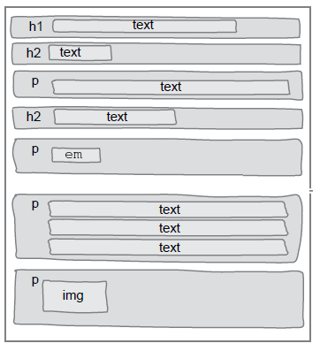


Elementos **`block`**
  ~ Ocupam **toda a largura** disponível
  ~ Dispostos de **cima para baixo**
  ~ **Quebram linha**

Elementos **`inline`** <!-- {strong:.alternate-color} -->
  ~ Ocupam o **espaço necessário**  <!-- {.alternate-color} --> (não mais)
  ~ Dispostos da **esquerda para direita**  <!-- {.alternate-color} -->

---
<!-- {"backdrop": "oldtimes"} -->
## Alterando o fluxo com `float` e `clear`

- ::: figure .figure-slides.push-right
  <div class="bullet figure-step bullet-no-anim">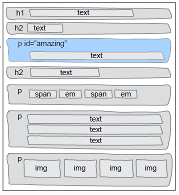<figcaption>Sem float</figcaption></div>

  <div class="bullet figure-step bullet-no-anim">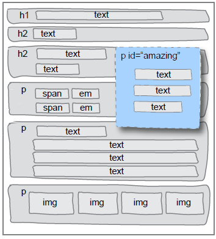<figcaption>Com float</figcaption></div>
  :::
  Flutuando o parágrafo à direita:
  ```css
  p#amazing {
    width: 200px;
    float: right;
  }
  ```
  <!-- {ul:.full-width} -->
- Quem flutua é **removido do fluxo**
  - _i.e._, não ocupa mais espaço
- Elementos **<u>depois</u> do flutuante**:
  - Os `block`: passam a ignorar o elemento flutuante
  - Os `inline`: respeitam o flutuante


---
<!-- {"backdrop": "exemplo-position-absolute"} -->
## **Limitações** do fluxo padrão

- Mesmo com `float` e `clear` não é possível fazer algumas coisas
  - Por exemplo, como colocar um texto em cima de uma imagem?

---
# A propriedade `position`

- **A propriedade `position`** permite definirmos se o navegador vai
  dispor um elemento usando **o fluxo padrão ou outro fluxo**
- Valores possíveis:
  1. `position: static` (valor padrão, para o fluxo padrão)
  1. `position: relative`
  1. `position: absolute`
  1. `position: fixed`
  1. `position: sticky` 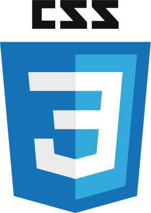 <!-- {.emoji} -->

---
<!-- {"classes": "compact-code"} -->
## Posicionamento **estático**

- O próprio navegador encontra as posições (x,y) dos elementos
- É o valor padrão - usa o posicionamento do fluxo padrão
  ```html
  <div class="estatico">Conteúdo</div>
  ```
  ```css
  .estatico {
    position: static; /* este já é o valor padrão */
  }
  ```
- <div style="float:right;font-size:.4em;"><input type="checkbox" checked id="button-estatico" class="switch" onclick="javascript: (function() { var b = document.getElementById('estatico'); b.classList.toggle('estatico');}())" />
    <label for="button-estatico">.estatico</label>
  </div>
  Resultado
  <style>.estatico {position: static;}</style>
  <div id="estatico" class="estatico" style="border: 3px dashed rebeccapurple">Conteúdo</div>

  - Definir um `position: static` não altera nada


---
<!-- {"layout": "section-header", "hash": "posicionamento-relativo"} -->
# Posicionamento relativo
## Deslocando elementos

- O valor `relative`
- **Deslocando** um elemento com as propriedades:
  1. `top`
  1. `right`
  1. `bottom`
  1. `left`

<!-- {ul:.content} -->

---
## Posicionamento **relativo**

- O elemento é posicionado como se estivesse no fluxo padrão, mas pode ser
  **deslocado** com as propriedades `top`, `right`, `bottom` e `left`
  ```html
  <div class="relativo1">Comporta-se como static...</div>
  <div class="relativo2">...Mas pode ter um deslocamento.</div>
  ```
  ```css
  .relativo1 { position: relative; }
  .relativo2 { position: relative; left: 30px; top: -10px; }
  ```
- <div style="float:right;font-size:.4em;"><input type="checkbox" checked id="button-relativo2" class="switch" onclick="javascript: (function() { var b = document.getElementById('relativo2'); b.classList.toggle('relativo2');}())" />
    <label for="button-relativo2">.relativo2</label>
  </div>
  Resultado:
  <style>.relativo2 { position: relative; left: 30px; top: -10px; }</style>
  <div style="position: relative; border: 3px dashed rebeccapurple; background: var(--presentation-color);">Comporta-se como <code>static</code>...</div>
  <div id="relativo2" class="relativo2" style="border: 3px dashed green; background: var(--presentation-color);">...Mas pode ter um deslocamento.</div>

---
## Detalhes sobre `position: relative`

1. O elemento continua no **fluxo normal**, a menos que tenha suas propriedades
   `top` :arrow_up:, `right` :arrow_right:, `bottom` :arrow_down: e `left`
   :arrow_left: ajustadas.
1. A posição do elemento será **ajustada com relação à sua posição original**
   (caso ele fosse `static`)
1. Os elementos posteriores a um elemento com `position: relative` **não
   são ajustados** para ocupar eventuais "buracos" na página

---
<!-- {"backdrop": "exemplo-position-relative"} -->
## **Utilidade** do `position: relative` (1/2)

- É útil quando queremos que um elemento fique próximo de onde ele estaria,
  mas **levemente deslocado**
  - Legal para **"dar um charme"** no _layout_

---
## **Utilidade** do `position: relative` (2/2)

<style>
.button-img {
  position: relative;
}
.button-img:active {
  left: -3px;
  top: -3px;
}
</style>

- Podemos fazer um pequeno deslocamento dando a ideia de botão:
  ::: figure .push-right.center-aligned
   <!-- {.button-img} -->
  <br>Click me!
  :::
  ```css
  img {
    position: relative;
  }
  img:active {
    left: -3px;
    top: -3px;
  }
  ```
- Também utilizamos `position: relative` para definir um "plano de
  referência" para os filhos que estiverem com `position: absolute`
  (veremos mais adiante)

---
<!-- {"layout": "section-header", "hash": "posicionamento-absoluto"} -->
# Posicionamento absoluto
## Definindo (x,y) dos elementos

- O valor `absolute`
- **Posicionando** com:
  1. `top` :arrow_up:
  1. `right` :arrow_right:
  1. `bottom` :arrow_down:
  1. `left` :arrow_left:
- Casos comuns
<!-- {ul:.content} -->

---
## Posicionamento **absoluto**

- O elemento é colocado nas posições especificadas pelas propriedades
  `top` :arrow_up:, `right` :arrow_right:, `bottom` :arrow_down: e `left`
  :arrow_left:, considerando como referência **o ancestral
  mais próximo que esteja posicionado não estaticamente** (`relative`, `absolute` ou
  `fixed`)
  - Se não houver um ancestral, posiciona de acordo com elemento `<html>`
- **Não ocupa espaço**, já que o elemento é removido do fluxo

---
<!-- {"classes": "compact-code-more"} -->
## Exemplo de posição absoluta

- <!-- {ul:.full-width.no-bullets.no-padding} -->
  ```html
  <div class="de-fora">Este é um recipiente relativo.
    <div class="de-dentro">Este é absoluto.</div>
  </div>
  ```
- <!-- {li:.two-column-code} -->
  ```css
  .de-fora {
    position: relative;
  }
  
  
  
  .de-dentro {
    position: absolute;
    width: 50%;
    right: 30px;
    bottom: 10px;
  }
  ```
  <div style="float:right;font-size:.4em;"><input type="checkbox" checked id="button-absoluto" class="switch" onclick="javascript: (function() { var b = document.getElementById('absoluto'); b.classList.toggle('de-dentro');}())" />
    <label for="button-absoluto">.de-dentro</label>
  </div>
  Resultado:
  <style>.de-dentro { position: absolute; width: 50%; right: 30px; bottom: 10px; }</style>
  <div style="position: relative; height: 140px; border: 3px dashed rebeccapurple; background: var(--presentation-color)">Este é um recipiente relativo.
    <div id="absoluto" class="de-dentro" style="border: 3px dashed green; background: var(--presentation-color)">Este é absoluto.</div>
  </div>

---
## **Utilidades** do `position: absolute`

1. <video src="../../videos/exemplo-position-absolute-steam.mp4" loop="0" class="push-right" controls></video>
   **Criar _"drop-downs"_** de opções que não "empurram" a página pra baixo
   (porque não ocupam espaço)
1. Colocar elementos "**um em cima do outro**"
    <!-- {.block.centered} -->
1.  <!-- {.push-right} -->
   **Posicionar** elementos em **qualquer lugar** - um (x,y) - na página

<!-- {ol:.bulleted} -->
---
## **Detalhes** do `position: absolute`

- O elemento **não tem espaço reservado para ele**. Em vez disso, ele fica
  exatamente na posição especificada por `top`, `right`, `bottom`, `left`
  relativo ao **seu mais próximo antecessor-posicionado (não _static_)**
  <!-- {strong:.underline.upon-activation.delay-1600} -->

   <iframe width="100%" height="300" src="//jsfiddle.net/fegemo/nt2bqmar/embedded/result,html/" allowfullscreen="allowfullscreen" frameborder="0" class="bordered rounded"></iframe>

---
<!-- {"layout": "section-header", "hash": "posicionamento-fixo"} -->
# Posicionamento fixo
## Definindo (x,y) dos elementos **na janela**

- O valor `fixed`
- **Posicionando** com:
  1. `top` :arrow_up:
  1. `right` :arrow_right:
  1. `bottom` :arrow_down:
  1. `left` :arrow_left:
- Casos comuns
- `z-index`
<!-- {ul:.content} -->

---
## Posicionamento **fixo**

- O elemento é posicionado de acordo com os valores das propriedades `top`,
  `right`, `bottom` e `left`, assim como `absolute`, porém **seu ponto de
  partida é o canto superior esquerdo da _janela_** <!-- {em:.underline.upon-activation.delay-1200} -->
- Não acompanha a rolagem da página
- Não ocupa espaço, já que o elemento é removido do fluxo

---
<!-- {"layout": "2-column-content"} -->
## Posição fixa (cont.)

- <!-- {ul:.no-bullets.no-padding} -->
  ```html
  <div class="bilhete">
    Este é um elemento fixo.
  </div>
  ```
  ```css
  .bilhete {
    position: fixed;
    right: 0;
    bottom: 10px;
  }
  ```
1. <!-- {ol:.no-bullets.no-padding} -->
   Resultado:
   <iframe width="100%" height="332" src="https://jsfiddle.net/fegemo/s01Lc3a8/2/embedded/result,html,css/" allowfullscreen="allowfullscreen" frameborder="0" class="rounded bordered"></iframe>

---
<!-- {"layout": "2-column-content-zigzag"} -->
## **Utilidade** do `position: fixed`

- Manter elementos **sempre na mesma posição**, independente da **barra
  de rolagem**

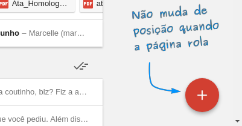


- Criar **caixas de diálogo modais** (que o usuário precisa interagir ou fechar)

---
## **position** -- Exemplo com todos

<style>
.minibola{
  display: inline-block;

  width:48px;

  padding: 4px 15px;
  border: 2px solid rebeccapurple;
  background: rgba(255, 255, 255, .5);
  border-radius: 70px;

}
</style>


- Considere que:
  - O div representado pelo **quadrado pontilhado** está como
    **`position:relative`**
  - O div <span class="minibola"> 2 </span> possui as propriedades:
    **`top:-20px`** e **`left: 30px`**

<iframe width="50%" height="260" src="//jsfiddle.net/fegemo/jnjvsqy4/embedded/result,html,css/" allowfullscreen="allowfullscreen" frameborder="0" class="bordered rounded flex-align-center"></iframe>

---
<!-- {"layout": "section-header", "hash": "alterando-a-visibilidade"} -->
# Alterando a visibilidade
## Fazendo elementos aparecerem ou sumirem

- Com `display: none`
- Com `visibility: hidden`
- Com `opacity: 0`
<!-- {ul:.content} -->

---
## Visibilidade usando **display**

- É possível tornar um elemento invisível usando `display: none;`
- O elemento é **removido do fluxo**, ou seja, o espaço onde ele seria
  posicionado é liberado
  ```css
  img#logotipo {
    display: none;
  }
  ```

---
## A propriedade **visibility** ([na MDN](https://developer.mozilla.org/en-US/docs/Web/CSS/visibility))

- Usada para alterar a visibilidade de elementos
  ```css
  img#logotipo {
    visibility: hidden; /* visible */
  }
  ```
- Os elementos invisíveis (`hidden`) continuam ocupando espaço
- Descendentes de elementos invisíveis herdam o valor `hidden`, mas podem
  tornar-se visíveis usando `visibility: visible;`

---
## A propriedade **opacity** ([na MDN](https://developer.mozilla.org/en-US/docs/Web/CSS/opacity))

- Usada para definir a opacidade (transparência) de elementos
  ```css
  video {
    opacity: 0.5; /* 0.0 (transparente) a 1.0 (opaco) */
  }
  ```
- Os elementos transparentes continuam ocupando espaço, mas deixam transparecer
  quem está "atrás" deles

1. <!-- {ol:.no-bullets.layout-split-2.no-margin.no-padding.full-width} -->
   <iframe width="600" height="180" src="//jsfiddle.net/fegemo/dr3546z9/embedded/result,html,css/" allowfullscreen="allowfullscreen"  allowpaymentrequest frameborder="0" class="bordered"></iframe>
1. ↙️ Comparação entre `display`, `visibility` e `opacity`

---
## A propriedade **overflow** ([na MDN](https://developer.mozilla.org/en-US/docs/Web/CSS/overflow))

- Controla se conteúdo que extrapola o elemento deve ser cortado, se deve ser
  mostrado ou se deve ser criada uma barra de rolagem
  ```css
  div {
    overflow: scroll; /* visible, hidden, scroll, auto */
  }
  ```
- Exemplo:
  - <!-- {li^0:.no-bullets.no-padding.layout-split-2.compact-code} -->
    ```css
    div {
      max-height: 175px;
      overflow: auto;

      /* para visualizar a div */        
      border: 1px dashed gray;
    }
    ```
    ::: result . max-width: 50%
    <div style="max-height: 175px; overflow: auto; border: 1px dashed gray;">
      <p class="smaller-text-70">Cultuadas ao longo da história por diversas civilizações como símbolo
        de riqueza, trabalho ou de perseverança, pela forma como defendem
        seu território, as abelhas surgiram muito antes do homem,
        há mais de 100 milhões de anos.
      </p>
      <p class="smaller-text-70">Pertencentes à ordem <em>Hymenoptera</em> e à superfamília dos
        <em>Apoidea</em> (grupo <em>Apiformes</em>), as abelhas se dividem em
        cerca de 20 mil espécies e a mais conhecida é a
        <em>Apis mellifera</em>.
      </p>
    </div>
    :::
---
<!-- {"layout": "section-header", "hash": "flexbox"} -->
# Flexbox
## Layouts de 1D

- `flex`, `inline-flex`
- Propriedades acessórias
- Exemplos
<!-- {ul:.content} -->


---
<!-- {"layout": "tall-figure-left", "slideStyles": {"grid-template-columns": "auto 1fr"}} -->
## Display: **flex** e **inline-flex**  <!-- {.emoji} -->

<div class="caniuse" data-feature="flexbox"></div>

- Mais recentemente, o CSS3 introduziu o **flexbox**
- É uma forma **bem flexível** para dispor os elementos
- Cria uma linha (`row`) ou coluna (`column`) com filhos
- Além de `display: flex` e `display: inline-flex`, foram introduzidas outras propriedades. Exemplos:

`flex-direction` <!-- {dl:.span-columns.width-20.full-width.no-margin} -->
~ `row` (padrão), `column`, `row-reverse`, `column-reverse`
~ dispõe filhos na horizontal (se `row`) ou vertical (`column`)

`justify-content`
~ `flex-start` (padrão), `center`, `space-around`, `space-between`...
~ define como distribuir o espaço que sobrou

`align-items`
~ `stretch` (padrão), `flex-start`, `center`...
~ define posição dos elementos no "contraeixo"

---
<!-- {"layout": "2-column-content", "embeddedStyles": ".horizontal-flex-example li { font-size: .8em; flex: 1; margin-right: 4px; background: #fffc; outline: 1px solid silver; } .horizontal-flex-example { display: flex; justify-content: space-between; list-style-type: none; padding-left: 0; }"} -->
## Exemplo com flexbox: lista horizontal

```css
ul.horizontal {
  display: flex;
  justify-content: space-around;

  /* tirar coisas que vem na <ul> */
  list-style-type: none;
  padding-left: 0;
}

ul.horizontal > li {
  flex: 1; /* crescer com peso 1 */
  
  /* espacinho e centralização */
  margin-right: 4px;
  text-align: center;
}
```

- ::: result . text-align: center
  - Abacaxi <!-- {ul:.horizontal-flex-example} -->
  - Kiwi
  - Maçã
  - Uva
  - Limão
  :::
- Colocamos `display: flex` **no pai** <!-- {ul^1:.no-bullets.no-padding.bulleted-0} -->
- Faz os filhos se comportarem de um jeito diferente
- Vamos usar outras propriedades (além de `display`). Ex:
  1. `flex-direction` (**linha** ou coluna)
  1. `justify-content` (como dist. espaço)
  1. `flex-wrap` (continuar na próxima linha ou coluna?)

---
# Jogo [Flexbox Froggy 🌐][flex-frog] <!-- {target="_blank"} --> <span style="font-family: 'Source Code Pro', monospace; font-size: 0.25em; opacity: 0.5;">~ melhor professor de flexbox ~</span>

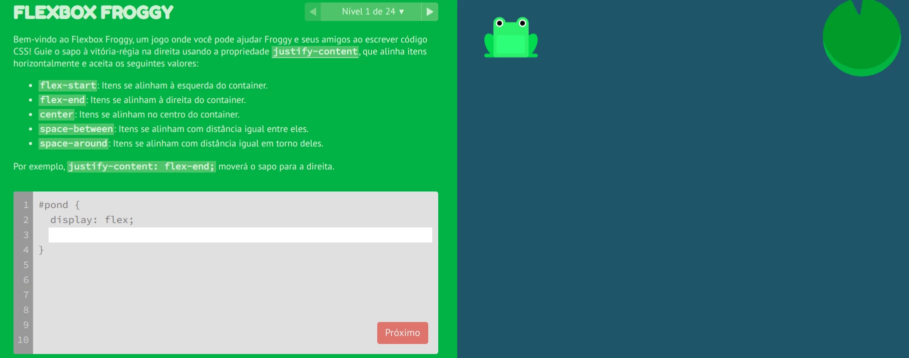 <!-- {.full-width.bordered.rounded} -->

[flex-frog]: https://flexboxfroggy.com/#pt-br

---
<!-- {"layout": "2-column-content", "hash": "como-funciona-o-flexbox"} -->
## Como funciona o flexbox <small>(1/3)</small>

1. <!-- {li:.no-bullets.no-padding.no-margin} -->
   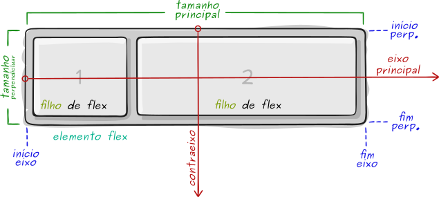 <!-- {.full-width} -->
1. Ideia: habilidade do elemento alterar o tamanho de seus filhos (e ordem) para ocupar o espaço disponível <!-- {ol:start="0"} -->
1. Há propriedades para o **elemento flex** e para seus **filhos** <!-- {.alternate-color} -->
   - Apenas o pai tem `display: flex`

- <!-- {ul:.no-bullets.no-padding.no-margin} -->
  **`flex-direction`** define o **eixo principal** e o contraeixo
- 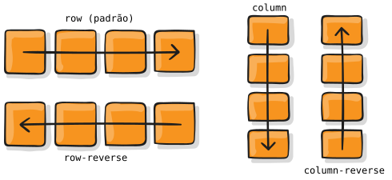 <!-- {.large-width.centered.block} -->
- **`flex-wrap`** se precisar quebra linha?
- 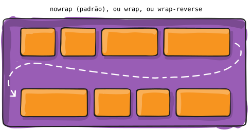 <!-- {.large-width.centered.block} -->

---
<!-- {"layout": "3-column-content"} -->
## Como funciona o flexbox <small>(2/3)</small>

- <!-- {ul:.no-bullets.no-padding.no-margin} -->
  **`justify-content`** distribui espaço em branco no eixo principal
- 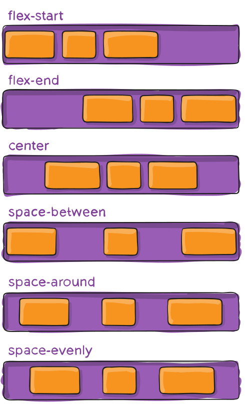 <!-- {.medium-width.centered.block} -->

1. <!-- {ol:.no-bullets.no-padding.no-margin} -->
   **`align-items`** alinhamento no contraeixo
1. 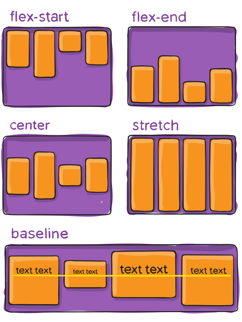 <!-- {.large-width.centered.block} -->

- <!-- {ul:.no-bullets.no-padding.no-margin} -->
  **`align-content`** distribui espaço em branco no contraeixo
-  <!-- {.large-width.centered.block} -->
- Só se `flex-wrap` !== `nowrap`

---
<!-- {"layout": "3-column-content"} -->
## Como funcionam os **filhos** de flexbox  <!-- {.alternate-color} -->   <small>(3/3)</small>

- <!-- {ul:.no-bullets.no-padding.no-margin} -->
  **`flex`** <!-- {.alternate-color} --> define o peso do elemento no eixo na hora de definir seu tamanho
- 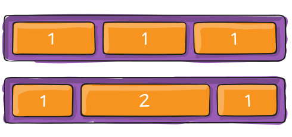 <!-- {.large-width.centered.block} -->
- ⬆️ na verdade, é atalho para `flex-grow`, `flex-shrink` e `flex-basis`

1. <!-- {ol:.no-bullets.no-padding.no-margin} -->
   **`align-self`** <!-- {.alternate-color} --> alinhamento no contraeixo apenas deste filho
1. 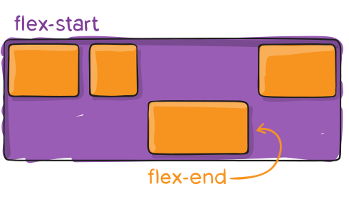 <!-- {.large-width.centered.block.bullet} -->
1. **`gap`** define um espaço mínimo entre filhos
   <!-- {li:.bullet} -->
   - 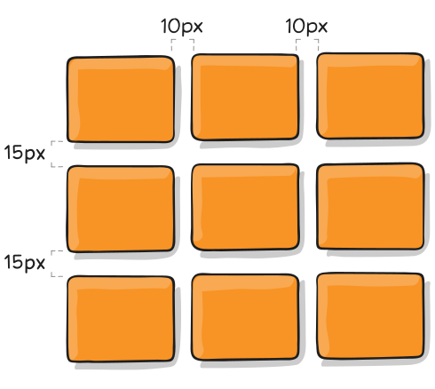  <!-- {.medium-width} -->
     <!-- {ul:.no-bullets} -->

- <!-- {ul:.no-bullets.no-padding.no-margin} -->
  **`order`** <!-- {.alternate-color} --> define uma ordem diferente da do código fonte
- 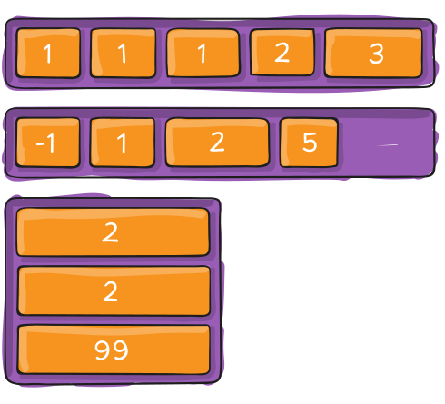 <!-- {.large-width.centered.block} -->

---
<!-- {"layout": "section-header", "hash": "grid"} -->
# Grid
## Layouts de 2D

- Propriedades acessórias
- Exemplos
- Grid Garden
<!-- {ul:.content} -->

---
# CSS **Grid** Layout

- Flexbox é ótimo para layouts de 1 dimensão (linhas ou colunas)
- Grid cria layouts de 2 dimensões (linhas e colunas)
- Além de `display: grid` (e `inline-grid`), várias novas propriedades foram introduzidas
- Há propriedades para o **elemento grid** e para os **filhos de grid** <!-- {.alternate-color} -->
  - Algumas propriedades do Flexbox também são usadas
- Deve-se definir as linhas e colunas e seus tamanhos

---
<!-- {"layout": "2-column-content", "classes": "compact-code-more"} -->
## Exemplo usando `grid`

- HTML <!-- {ul:.no-bullets.no-padding} -->
  ```html
  <main>
    <header></header>
    <nav></nav>
    <section></section>
    <footer></footer>
  </main>
  ```
  CSS (elemento pai)
  ```css
  main {
    display: grid;
    grid-template-rows: 200px 1fr auto;
    grid-template-columns: 300px 1fr;
  }
  ```

1. CSS (dos filhos) <!-- {ol:.no-bullets.no-padding.two-column-code} -->
   ```css
   header {
     grid-column: 1 / 3;
   }

   nav {
     grid-column: 1 / 2;
     grid-row: 2 / 3;
   }
   section {
     grid-column: 2 / 3;
     grid-row: 2 / 3;
   }
   footer {
     grid-column: 1 / 3;
     grid-row: 3 / 4;
   }
   ```
   ::: result .full-width height: 250px; display: grid; grid-template-rows: 60px 1fr auto; grid-template-columns: 90px 1fr;
   <header style="background: lightblue; grid-column: 1/3;"></header>
   <nav style="background: black; grid-column: 1/2; grid-row: 2/3;"></nav>
   <section style="background: green; grid-column: 2/3; grid-row: 2/3;"></section>
   <footer style="background: gray; grid-column: 1/3; grid-row: 3/4; min-height: 40px;"></footer>
   :::

---
<!-- {"layout": "main-point", "state": "emphatic"} -->
# Conheça o Grid Garden 🥕

---
# Jogo [Grid Garden 🌐][grid-garden] <!-- {target="_blank"} --> <span style="font-family: 'Source Code Pro', monospace; font-size: 0.25em; opacity: 0.5;">~ melhor professor de grid ~</span>

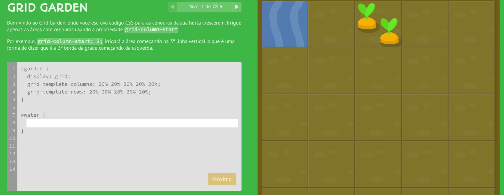 <!-- {.full-width.bordered.rounded} -->

[grid-garden]: https://cssgridgarden.com/#pt-br

---
<!-- {"layout": "3-column-content", "hash": "conceitos-sobre-grid"} -->
## Conceitos sobre Grid

- **Elemento grid**: <!-- {ul:.no-padding.no-bullets} -->
  aquele que tem `display: grid` ou `inline-grid`
- **Filho de grid**: <!-- {.alternate-color} -->
  todos os filhos diretos de um **elemento grid**
  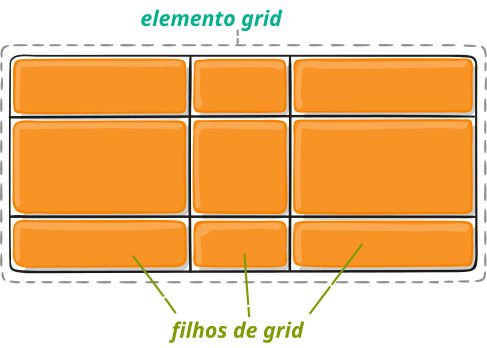 <!-- {.large-width.centered.block style="margin-top: 1.75em;"} -->

1. **Calha**<!-- {style="color: unset"} -->: <!-- {ol:.no-bullets.no-padding} -->
   traço entre linhas ou colunas (ou início/final)
   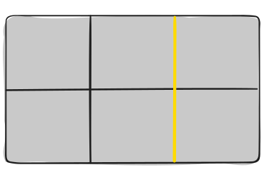 <!-- {.medium-width.centered.block} -->
1. **Célula**<!-- {style="color: unset"} -->:
   espaço entre quatro calhas
   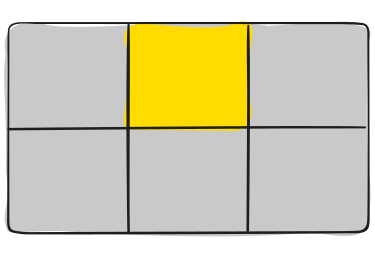 <!-- {.medium-width.centered.block} -->

- **Trilha**<!-- {style="color: unset"} -->: linha ou coluna <!-- {ul:.no-bullets.no-padding} -->
  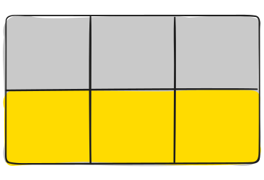 <!-- {.medium-width.centered.block} -->
- **Área**<!-- {style="color: unset"} -->: conjunto adjacente e retangular de células
  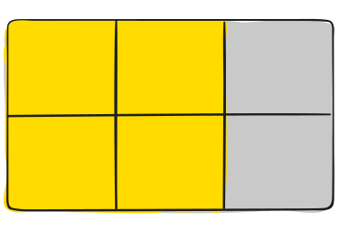 <!-- {.medium-width.centered.block} -->

---
<!-- {"layout": "2-column-content", "classes": "compact-code-more", "hash": "como-funciona-o-grid"} -->
## Como funciona o Grid <small>(1/3)</small>

- <!-- {ul:.no-bullets.no-padding.no-margin} -->
  **`grid-template-columns`**, **`grid-template-rows`** definem quantidade e tamanho de colunas e linhas
  ```css
  .container {
    grid-template-columns: 40px 50px auto 50px 40px;
    grid-template-rows: 25% 100px auto;
  }
  ```
- 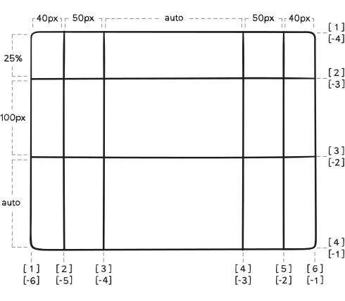 <!-- {.medium-width.centered.block} -->

1. <!-- {ol:.no-bullets.no-padding.no-margin} -->
   **`grid-column`**<!-- {.alternate-color} -->, **`grid-row`** <!-- {.alternate-color} --> especifica as <u>calhas</u> da célula onde o filho será colocado 
   ```css
   .item-a {
     grid-column: 2 / 5;
     grid-row: 1 / 3;
   }
   ```
1. 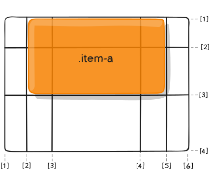 <!-- {.medium-width.centered.block} -->

---
<!-- {"layout": "2-column-content", "classes": "compact-code-more"} -->
## Como funciona o Grid <small>(2/3)</small>

- <!-- {ul:.no-bullets.no-padding.no-margin} -->
  **`grid-template-areas`** dá nomes às áreas da grid
  ```css
  .container {
    display: grid;
    grid-template-columns: repeat(1fr, 4);
    grid-template-rows: repeat(1fr, 3);
    grid-template-areas: 
      "header header header header"
      "main main . sidebar"
      "footer footer footer footer";
  }
  ```
  - Um `.` é uma célula vazia
  - `repeat(n, valor)` é um atalho

1. <!-- {ol:.no-bullets.no-padding.no-margin.two-column-code} -->
   **`grid-area`**<!-- {.alternate-color} --> especifica nome da <u>área</u> onde o filho será colocado 
   ```css
   .item-a {
     grid-area: header;
   }
   .item-b {
     grid-area: main;
   }
   .item-c {
     grid-area: sidebar;
   }
   .item-d {
     grid-area: footer;
   }
   ```
1.  <!-- {.medium-width.centered.block} -->
<!-- {li:.no-bullets.no-padding} -->

---
<!-- {"layout": "2-column-content", "classes": "compact-code"} -->
## Como funciona o Grid <small>(3/3)</small>

- Além dessas propriedades, há várias outras
  1. **`gap`**: define espaço entre linhas e colunas
      <!-- {.small-width.centered.block} --> 
     ```css
     .container {
       gap: 15px 10px;
     }
     ```

1. **`justify-items`** <!-- {ol:start="2"} -->
1. **`align-items`**
1. **`justify-content`**
1. **`align-content`**
1. **`grid-auto-columns`**, **`grid-auto-rows`**
1. **`justify-self`** <!-- {.alternate-color} -->
1. **`align-self`** <!-- {.alternate-color} -->
1. Veja o [guia completo de Grid][grid-css-tricks] em CSS Tricks <!-- {li:.note.info} -->

[grid-css-tricks]: https://css-tricks.com/snippets/css/complete-guide-grid/

---
<!-- {"layout": "centered"} -->
# Referências

- [Guia completo de Flexbox][flex-css-tricks] em CSS Tricks
- [Guia completo de Grid][grid-css-tricks] em CSS Tricks

[flex-css-tricks]: https://css-tricks.com/snippets/css/a-guide-to-flexbox/
[grid-css-tricks]: https://css-tricks.com/snippets/css/complete-guide-grid/