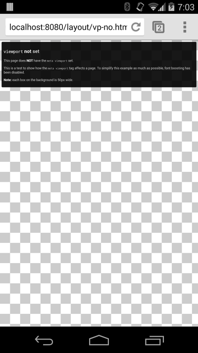
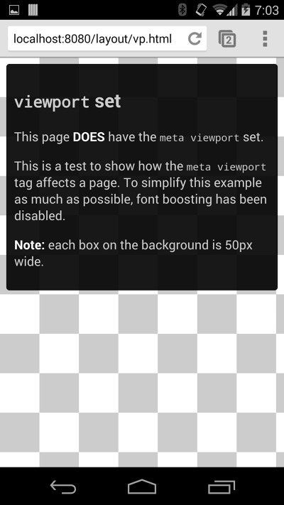
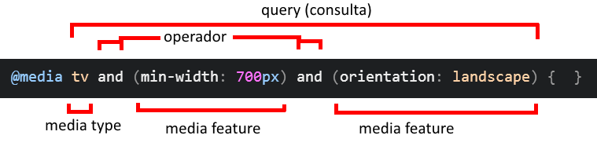
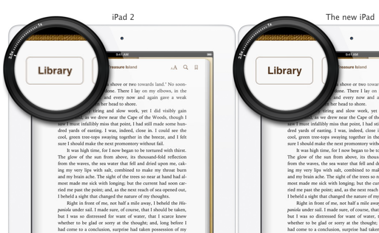
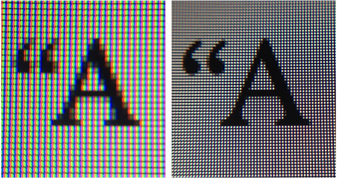

<!-- {"layout": "title"} -->
# **CSS** parte 4
## _Responsive Web Design_

---
<!-- {"embeddedStyles": ".multi-dispositivos { justify-content: center; } .multi-dispositivos li { text-align: center; margin-right: 2em; } .multi-dispositivos img { max-height: 160px; display: block; margin: auto; }"} -->
# A Web é multi-dispositivos


1.  <!-- {.invert-colors-dark-mode} --> <!-- {ol:.multi-dispositivos.card-list style="flex-wrap: wrap"} -->
   Computadores
1.  <!-- {.invert-colors-dark-mode} -->
   Telefones/_tablets_ 
1.  <!-- {.invert-colors-dark-mode} -->
   _Videogames_
1.  <!-- {.invert-colors-dark-mode} -->
   _Smart TVs_
1.  <!-- {.invert-colors-dark-mode} -->
   [_Smartwatches_](https://www.youtube.com/watch?v=Ok1zcRQbvnk)
1.  <!-- {.invert-colors-dark-mode} -->
   _VR headsets_
1.  <!-- {.invert-colors-dark-mode} -->
   Carros

*[VR]: Virtual Reality*


---
# O que varia entre dispositivos?

1. Tamanho da tela
1. Razão de aspecto (largura/altura)
1. Tipo de _input_ (mouse/teclado, toque (multi), gestos)
1. Densidade de pixels da tela
1. Quantidade de cores
1. Conexão com a Internet

---
<!-- {"fullPageElement": "#responsive-resize", "playMediaOnActivation": {"selector": "#responsive-resize" }} -->

<video src="//fegemo.github.io/cefet-front-end-large-assets/videos/responsive-resize.webm" loop="-1" controls id="responsive-resize"></video>

---
# **Diretrizes** para a web multi-dispositivos <!-- {h1:style="font-size: 2.5em;"} -->

1. **Independer de ampliação**
   - Usuário não deve precisar dar _zoom_ para enxergar/interagir
1. **Independer da razão de aspecto** (larg/alt)
   - Página deve se adequar para ficar longa ou achatada
1. **Aproveitar todo o espaço disponível, não mais, não menos**
   - Não permitir barras de rolagem horizontais
1. **Explorar da alta densidade de pixels**
   - Usar imagens com resolução suficiente ao dispositivo
1. **Otimizar o desempenho**
   - A página não pode demorar para carregar

---
<!-- {"layout": "centered"} -->
# Na aula de hoje

1. [A _tag_ `meta` _viewport_](#a-tag-meta-viewport)
1. [_Media queries_](#media-queries)
1. [Densidade de pixels](#densidade-de-pixels)
1. [_Responsive web design_](#responsive-web-design)
1. [A Super Loja](#a-super-loja) :convenience_store:

---
<!-- {"layout": "section-header", "hash": "a-tag-meta-viewport"} -->
# A _tag_ `meta` _viewport_
## Como definir a janela da página

- Carregando uma página no _smartphone_
- Relembrando a _tag_ `<meta>`
- Definindo a janela de pintura (_viewport_)
- Unidades de medida
<!-- {ul:.content} -->

---
<!-- {"layout": "2-column-content", "embeddedStyles": ".viewport-on-device { display: inline-block; margin: 0 3em 0 0; text-align: center; } .viewport-on-device img { margin: auto; display: block; max-height: 450px; } .viewport-on-device p { margin: 0; }"} -->

::: figure .viewport-on-device

<figcaption>Do jeito errado (se não<br>definirmos a <em>viewport</em>)</figcaption>
:::

::: figure .viewport-on-device

<figcaption>Do jeito certo<br>(<em>viewport</em> definida)</figcaption>
:::

---
## Carregando uma página no _smartphone_

- O navegador, por padrão, assume que a página vai ocupar uns 1000px
  de largura, mesmo em dispositivos com telas menores
  1. Navegador carrega a página
  1. Navegador vê que ela ocupou mais que a largura do dispositivo
  1. Navegador reduz (faz _zoom out_) na página
- Precisar dar zoom-in/out é uma experiência de uso ruim! <!-- {li:.note.info.bullet} -->
- Para evitar que o usuário precise ampliar/reduzir, **podemos definir qual <!-- {li:.bullet} -->
  a largura da "janela de pintura" (_viewport_)** da página
  - Para tanto, vamos usar uma _tag_ `<meta>`

---
<!-- {"backdrop": "oldtimes"} -->
## Codificação **Unicode** e UTF-8

- Unicode provê o suporte multilíngua <!-- {ul:.full-width} -->
  - Diversos alfabetos, não apenas o romano/latino
- **UTF-8** é uma codificação que usa uma sequência de **8 bits** para
  armazenar códigos UNICODE
  - Os 128 primeiros caracteres UTF-8 são idênticos aos ASCII
    - Ou seja, todo o alfabeto, pontuações mais comuns e números
- <!-- {li:.push-code-right.compact-code-more} -->
  ```html
  ...
  <head>
    <meta charset="utf-8">  <!-- USE ESTA META TAG -->
    <title>...</title>
    ...
  ```
  Em HTML, dentro do `<head>` da página, usamos uma `<meta>` _tag_ com
  o atributo `charset` para isso ➡️
  - Essa _tag_ deve aparecer nos primeiros 1024 caracteres da página ([entenda][mdn-charset])
- Para ASCII, seria `<meta charset="ISO-8859-1">` (ASCII romano/latino)

[mdn-charset]: https://developer.mozilla.org/pt-BR/docs/Web/HTML/Element/meta#attr-charset

---
## Definindo a janela de pintura

- Usamos `<meta name="viewport" content="...">` para definir a largura da janela:
  ```html
  <meta name="viewport" content="width=device-width, initial-scale=1">
  ```
  - `width=device-width` faz com que a "janela" do navegador tenha a largura
    igual à do dispositivo (não mais, não menos)
  - `initial-scale=1` faz com que a página **não seja** ampliada/reduzida
    inicialmente (mas ainda assim permitindo que o usuário o faça)
- <u>Devemos sempre usar</u> a `<meta name="viewport">` nos sites!
- Referência: [meta _tag_ viewport na MDN](https://developer.mozilla.org/en-US/docs/Mozilla/Mobile/Viewport_meta_tag)

---
## Unidades de medida

- Além da _viewport_, também precisamos definir **dimensões dos elementos**
  de forma que **caibam na janela**
- Técnicas:
  1. **Evitar larguras fixas** maiores que a janela
     - ~~`width: 900px`~~ :arrow_right: `width: 100%`
  1. Preferir **unidades de medida relativas**
     - ~~`padding-top: 90px`~~ :arrow_right: `padding-top: 25%`
- Mas o que são unidades de medida relativas?

---
## Unidades de medida **relativas**

- Absolutas (fixas) <!-- {li:style="opacity: 0.5;"} -->
  - `px`
  - `cm`, `mm`, `in`, `pt`, `pc`  <!-- {ul:.multi-column-list-2}-->
- Relativas ao tamanho do _container_:
  - `%`
- Relativas ao tamanho da fonte:
  - **`em`** (letra M)
  - `rem` (letra M - _root_)
  - `ex` (letra x)
  - `ch` (número 0) <!-- {ul:.multi-column-list-2}-->
- Relativas ao tamanho da janela:
  - `vh` (1/100 altura)
  - `vw` (1/100 largura)
  - `vmin` (1/100 menor dim.)
  - `vmax` (1/100 maior dim.) <!-- {ul:.multi-column-list-2}-->

---
## Exemplo: `em` _vs_ `rem`

<iframe height='265' scrolling='no' title='Exemplo em vs rem' src='//codepen.io/fegemo/embed/JrvRgL/?height=300&theme-id=dark&default-tab=html,result&embed-version=2' frameborder='no' allowtransparency='true' allowfullscreen='true' style='width: 100%;'>See the Pen <a href='https://codepen.io/fegemo/pen/JrvRgL/'>Exemplo em vs rem</a> by Flavio (<a href='https://codepen.io/fegemo'>@fegemo</a>) on <a href='https://codepen.io'>CodePen</a>.
</iframe>

- `em` é o `font-size` do elemento atual
- `rem` é o `font-size` do elemento `<html>` (_root element_)
  - ...que, por padrão, é `16px`
- **Quando usar**: para tamanhos, margens, `padding`, `line-height` etc.

---
## Exemplo: `vh` e `vw`

<iframe height='326' scrolling='no' title='Exemplo vh e vw' src='//codepen.io/fegemo/embed/jGxVMV/?height=326&theme-id=dark&default-tab=css,result&embed-version=2' frameborder='no' allowtransparency='true' allowfullscreen='true' style='width: 100%;'>See the Pen <a href='https://codepen.io/fegemo/pen/jGxVMV/'>Exemplo vh e vw</a> by Flavio (<a href='https://codepen.io/fegemo'>@fegemo</a>) on <a href='https://codepen.io'>CodePen</a>.
</iframe>

- `1vw` = 1/100 da largura da janela
- `1vh` = 1/100 da altura da janela
- **Quando usar**: para tamanhos de coisas que ocupam sempre **a mesma
  proporção da janela** (_e.g._, slides)

---
<!-- {"layout": "section-header", "hash": "media-queries"} -->
# _Media Queries_
## Regras CSS condicionais

- O que são _media queries_
- Anatomia de uma _media query_
- Tipos de mídia
- Características de mídia
<!-- {ul:.content} -->

---
## O que são _media queries_

- As _media queries_ têm o propósito de possibilitar a
  delimitação do escopo de regras CSS para **diferentes mídias**
- Exemplos:
  1. Arquivo com regras CSS para impressão
     ```html
     <link rel="stylesheet" media="print" href="p-impressao.css">
     ```
  1. Dentro de um arquivo CSS, regras diferentes para o tamanho de uma imagem
     se o dispositivo estiver orientado verticalmente (_portrait_) ou
     horizontalmente (_landscape_)
     - <!-- {ul:.no-bullets.no-padding.no-margin.layout-split-2} -->
       ```css
       img.produto {  
         width: 200px;
       }
       ```
     - ```css
       @media screen and (orientation: portrait) {
         img.produto {  width: 100%;  }
       }
       ```

---
## Anatomia de uma _media query_

 <!-- {p:.flex-align-center} -->

- Formada por:
  1. _Media types_
  1. _Media features_
  1. Operadores

---
## Tipos de Mídia

`all` <!-- {dl:.width-10} -->
~ Qualquer dispositivo

`print`
~ Para documentos paginados ou exibidos em modo de visualização de impressão (aperte <kbd>Ctrl+P</kbd>)

`screen`
~ Dispositivos com telas (normalmente) coloridas  

`speech`
~ Para sintetizadores de voz

---
## Exemplo de uso de tipo de mídia: **2 formas** <!-- {''.underline.upon-activation.delay-1000} -->

1. Arquivos **separados**: <!-- {ol:.full-width} -->
   ```html
   <link rel="stylesheet" media="all" href="estilos-gerais.css">
   <link rel="stylesheet" media="screen" href="para-monitores.css">
   <link rel="stylesheet" media="print" href="para-impressao.css">
   ```
1. Dentro de um **mesmo arquivo CSS**: <!-- {li:.two-column-code} -->
   ```css
   body {
     background-color: #ccc;
   }
   
   
   @media print {
     body {
       background-color: transparent;
     }
   }
   ```

---
## Características de Mídia

 <!-- {p:.flex-align-center.no-margin.small-width} --> <!-- {.full-width} -->

- `width`, `height`, **`max-width`**, `max-height`, `min-width`, `min-height`
  - Largura e altura da janela do navegador
- `aspect-ratio`
  - Razão da largura pela altura da janela do navegador
- `orientation`
  - Orientação (`landscape` x `portrait`) do dispositivo
- `resolution`
  - Densidade de _pixels_ do dispositivo
- [E mais...](https://developer.mozilla.org/en-US/docs/Web/CSS/@media)

---
## Exemplo de uso de características de mídia <small>(1/2)</small>

- **Forma 1**: Em arquivos separados
  ```html
  <!-- Arquivo de estilo para dispositivos pequenos -->
  <link rel="..." media="screen and (max-width: 640px)" href="small-screens.css">

  <!-- Arquivo de estilo para dispositivos grandes -->
  <link rel="..." media="screen and (min-width: 641px)" href="large-screens.css">
  ```

---
## Exemplo de uso de características de mídia <small>(2/2)</small>

- **Forma 2**: Dentro de um mesmo arquivo (mais comum)
  ```css
  #logo {
    width: 200px;
  }
  /* com o "celular em pé"", a logo vai ocupar 100% */
  @media screen and (orientation: portrait) {
    #logo {
      width: 100%;
    }
  }
  ```

---
<!-- {"layout": "section-header", "hash": "densidade-de-pixels"} -->
# Densidade de pixels
## Telas com "super definição"

- A origem: iPad 3
- Densidade de pixels
- Como aproveitar
<!-- {ul:.content} -->

---
<!-- {"backdrop": "resolutionary"} -->

---
## _Retina display_ (da Apple)

 <!-- {p:.flex-align-center} -->

---
## _Retina display_ (da Apple)

 <!-- {p:.flex-align-center} -->

---
<!-- {"embeddedStyles": "#calc-dpr { transition: all 200ms ease-out; } .vanished { opacity: 0; transform: scale(2); }"} -->
## Simulação de _**retina display**_

 <!-- {style="width: 100px"} -->
 <!-- {style="width: 100px"} --> <!-- {p:.flex-align-center} -->

Para testar em um dispositivo de **tela com alta densidade de pixels**:


 <!-- {style="width: 100px"} --> <!-- {p:.flex-align-center} -->
 <!-- {style="width: 100px"} -->

- Este dispositivo tem densidade: <span id="device-pixel-ratio">x</span> <button id="calc-dpr" onclick="this.disabled = true; setTimeout(() => { document.querySelector('#device-pixel-ratio').innerHTML = window.devicePixelRatio; this.style.visibility = 'hidden'; }, 200); this.classList.add('vanished');">🔢 <code>window.devicePixelRatio</code></button>

---
## Atributo `srcset` da imagem para a Densidade de Pixels


```html


```
-  A estrela será ajustada automaticamente considerando a densidade de pixels da tela (1x, 2x, 3x ou 4x)


---
<!-- {"layout": "section-header", "hash": "responsive-web-design"} -->
# _Responsive Design_
## Adequando ao dispositivo

- O que é
- Exemplos de sites
- Como fazer
<!-- {ul:.content} -->

---
## **O que é** _Responsive Design_

- Não significa desenho responsável =)
- É a idéia de que as páginas Web devem se adaptar à plataforma que a está
  exibindo
  - Melhorar a experiência de usuário
  - Aproveitar características específicas de plataformas diferentes
- Usa o recurso de _media queries_, mas também tamanhos fluidos, flexbox e grid

---
## Exemplo de site **_responsive_**

[](http://web.expressodev.com.br/) <!-- {.full-width} --> <!-- {p:.large-width.flex-align-center.bordered.rounded} -->

---
## Como fazer

- Para criar uma página _responsive_, você deve
  1. Usar **unidades de medida relativas**
  1. Definir os pontos (**largura**) em que a **página "quebra"**
     (os _breakpoints_)
  1. Criar **regras de estilos diferentes** para cada conjunto de dimensões
- Por exemplo, vamos criar uma página que mostra
  - 4 produtos por linha em dispositivos grandes
  - 3 produtos por linha em dispositivos médios
  - 2 produtos por linha em dispositivos pequenos

---
## Exemplo

```css
#produtos {  display: flex; }

@media (min-width: 801px) {
  /* tela grande: 4 produtos por linha */
  div.produto {  width: calc(100% / 4);  }
}

@media (min-width: 481px) and (max-width: 800px) {                 
  /* tela média: 3 produtos por linha */
  div.produto {  width: calc(100% / 3);  }
}

@media (max-width: 480px) {
  /* tela pequena: 2 produtos por linha */
  div.produto {  width: calc(100% / 2);  }
}
```

---
## Exemplo vivo

<iframe width="100%" height="450" src="//jsfiddle.net/fegemo/Lw7prv0u/6/embedded/result,css,html/" allowfullscreen="allowfullscreen" frameborder="0"></iframe>

---
<!-- {"layout": "section-header", "hash": "a-super-loja"} -->
# A **Super** Loja :convenience_store:
## Lojinha responsável

- Atividade de hoje

<!-- {ul:.content} -->

---
<!-- {"fullPageElement": "#super-store", "playMediaOnActivation": {"selector": "#super-store" }} -->

<video src="//fegemo.github.io/cefet-front-end-large-assets/videos/super-store.webm" controls id="super-store"></video>
