<!-- {"layout": "title"} -->
# **Introdução** à Programação Web
## História e conceitos básicos

---
<!-- {"layout": "centered"} -->
# Roteiro

1. [Web == Internet?](#web-igual-internet)
1. [O que é a Web](#o-que-e-a-web)
1. [Minha primeira página web](#minha-primeira-pagina-web)


---
<!-- {"layout": "section-header", "hash": "web-igual-internet"} -->
# Web == Internet?
## A Web é a mesma coisa que a Internet?

- Personagens da história
- Surgimento da Internet
- Internet pré-web
<!-- {ul:.content} -->

---
# Fatos importantes

Surgimento:
  ~ A **Internet** <!-- {.alternate-color} --> surgiu em 1969 com o nome
    de ARPANET
  ~ A **Web** surgiu entre 1989 e 1993

Criadores:
  ~ A **Internet** <!-- {.alternate-color} --> foi criada por pesquisadores
    nos EUA
  ~ A **Web** foi criada por um pesquisador na Europa

Fato:
  ~ A **Internet** <!-- {.alternate-color} --> é a maior rede de computadores
  ~ A **Web** é "um dos programas" (o maior) na Internet

Dúvidas:
  ~ 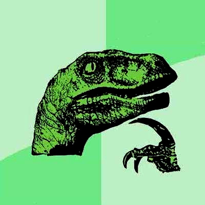 <!-- {.portrait.push-right} -->
    (a) Internet é com "I" ou com "i"?
  ~ (b) Como surgiu a Internet?

---
## Linha do Tempo (1/2)

1969
  ~ Larry Roberts estabelece 1º link da **ARPANET**

1974
  ~ Bob Kahn e Vint Cerf **especificam os protocolos TCP/IP**

1983
  ~ Bob Kahn e Vint Cerf implantam a **família de protocolos
    TCP/IP na ARPANET**

1974 - 1990
  ~ Outras **grandes redes se conectaram a ARPANET**
    (CSNET, NIPRNET, SPAN, NSN, ESNet, NSFNET, MILNET, SATNET, WIDEBRAND)

*[CSNET]: Computer Science Network*
*[MILNET]: Military Network*
*[NSFNET]: National Science Foundation Network*

---
<!-- {"layout": "centered"} -->

::: figure .embedded-caption
<figcaption class="caption-bottom centered">A Internet em 1986</figcaption>

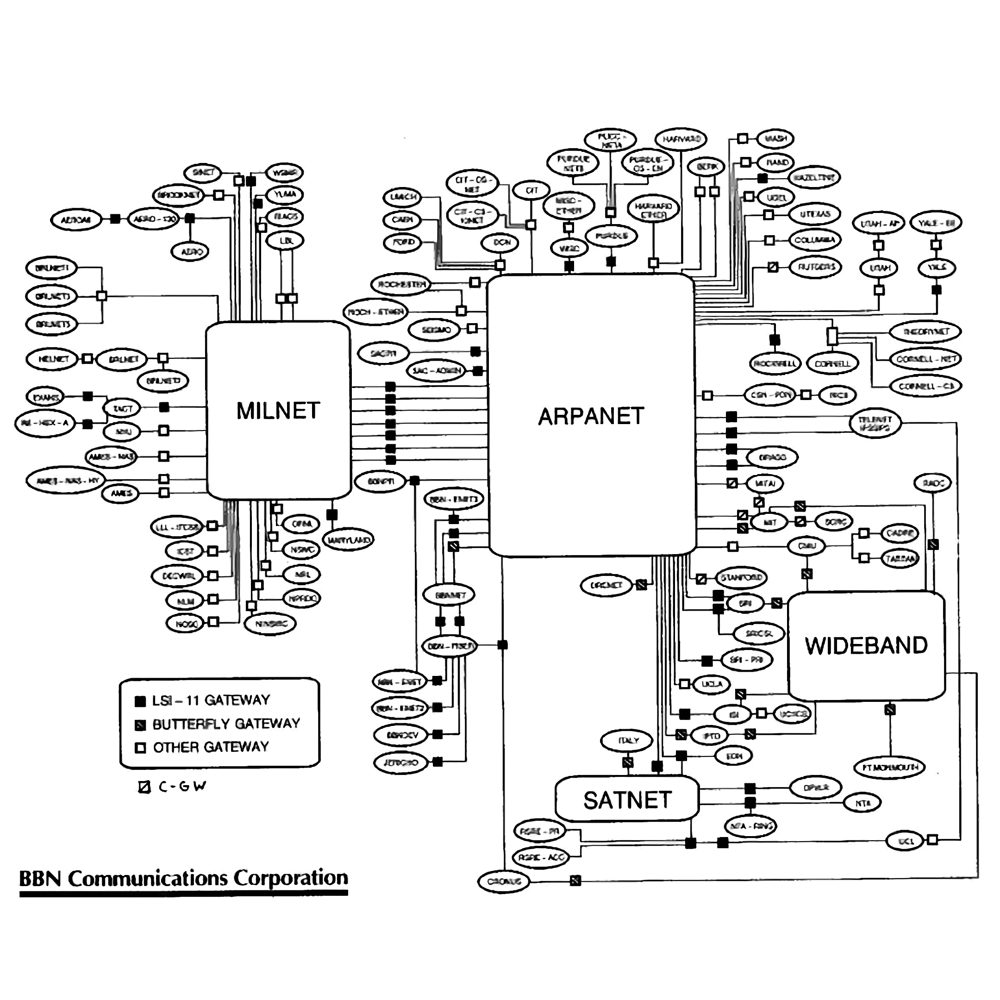 <!-- {.slide-contain} -->
:::

---
## Linha do Tempo (2/2)

1988 - 1989
  ~ Surgimento dos primeiros provedores de acesso ao
    público geral (ISP), dando forma à **Internet** (_case-sensitive_)

1992
  ~ O governo americano permitiu a conexão da Internet com
    outras redes que não eram exclusivamente de pesquisa

**1989 - 1993**
  ~ Tim Berners-Lee **cria a WWW** em CERN
    (_European Organization for Nuclear Research_) e a deixa aberta ao público
    geral

---
<!-- {"layout": "main-point", "state": "emphatic", "hash": "internet-pre-web"} -->
# Dúvida...
## Mas se a Web surgiu apenas em 1989, o que era a Internet antes dela?

::: figure .floating-portrait-container
 <!-- {.portrait} -->
:::

---
## A era Pré-web

- Correio eletrônico (E-mail, ~1965)
- BBS (_Bulletin Board System_, 1978), Usenet (1980), FTP (1985)
- WAIS, Archie, Veronica (mecanismos de busca)
- Gopher (1991)

---
<!-- {"layout": "centered"} -->
::: figure
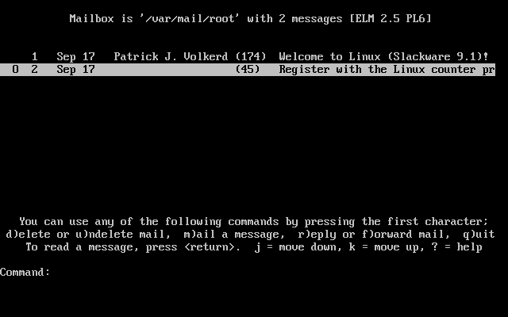
<figcaption>Cliente de E-mail ELM (1986)</figcaption>
:::

---
<!-- {"layout": "centered"} -->
::: figure
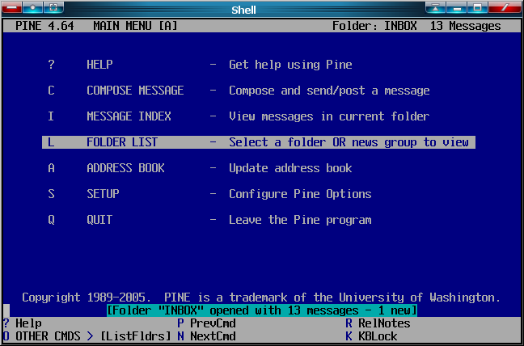
<figcaption>Cliente de E-mail Pine (1989)</figcaption>
:::

---
<!-- {"layout": "centered"} -->
::: figure
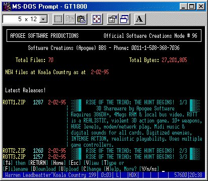
<figcaption>BBS Koala Country (1989)</figcaption>
:::

---
<!-- {"layout": "centered"} -->
::: figure
<figcaption>Usenet GNUs</figcaption>

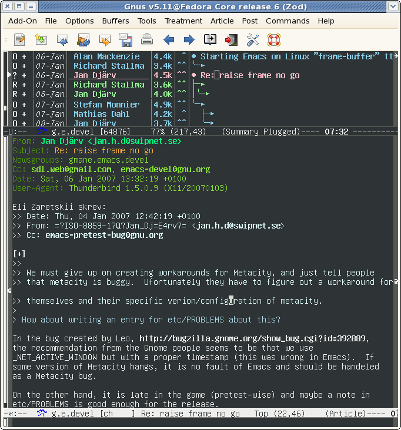 <!-- {style="height: 500px"} -->
:::

---
<!-- {"layout": "centered"} -->
::: figure
<figcaption>Gopher de Jospeh Maistre</figcaption>

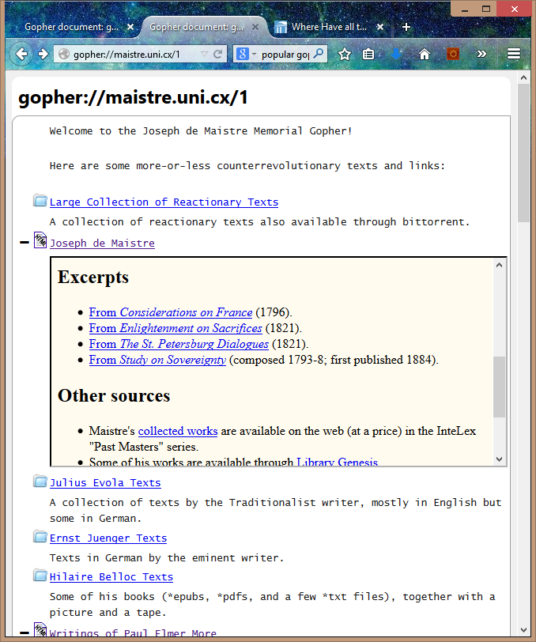 <!-- {style="height: 500px"} -->
:::

---
## A era Pré-web

- O que mais se aproximava de **troca organizada de documentos** era o
  **Gopher**
- O Gopher considerou que a melhor forma para apresentar a
  informação era de **forma hierárquica**
  - Contudo, hierarquizar a informação não é fácil, nem para fazer, nem para ler
- A _World Wide Web_ (WWW), proposta por Tim Berners-Lee, apresenta a
  informação em "formato de teia"

---
<!-- {"layout": "section-header", "hash": "o-que-e-a-web"} -->
# O que é a Web
## Definição e Composição

- Definição de Web
- Linguagens da Web
<!-- {ul:.content} -->

---
## Definição **(~~in~~formal)** de Web

- **World Wide Web**, ou WWW, traduz em "teia mundial"
  - Normalmente falamos apenas: a **Web**

1ª definição
  ~ É o que estamos vendo e interagindo quando abrimos um navegador
    (Chrome, Firefox etc.)

2ª definição
  ~ Um conjunto de documentos de **hipermídia** **interconectados**, tipicamente
    acessados pela Internet. Esses documentos são as **páginas web**.
    - **Hipermídia**: conteúdo digital que envolve texto, imagens, sons,
      vídeos etc.
    - **Interconectado**: um documento contém "links" (referências) a outros
      (daí a ideia de teia :spider_web:)

<!-- {dl:.bulleted} -->

---
## Definição **(formal)** de Web

Segundo Andrew Tanembaum (autor de vários livros de Computação):

> A Web é um **arcabouço arquitetural** para acessar<br>
> **conteúdo relacionado** que está espalhado em milhões<br>
> de computadores pela Internet.

<!-- {blockquote:.centered} -->

"Arcabouço arquitetural"
  ~ Conjunto de regras para a descrição, visualização e transmissão das
    páginas web

"Conteúdo relacionado"
  ~ As páginas podem conter referências (_links_, ou melhor, _hyperlinks_) para
    outras páginas

<!-- {dl:.width-40} -->

---
<!-- { "layout": "2-column-highlight-and-content" , "hash": "o-que-compoe-web"} -->
## O que **compõe** uma página web?

::: figure . height: 90%
<figcaption><a href="https://fegemo.github.io/cefet-web-ovelhas/racas-raras.html" target="_blank"><code>racas-raras.html</code></a></figcaption>
<iframe src="https://fegemo.github.io/cefet-web-ovelhas/racas-raras.html" height="90%" width="100%">
  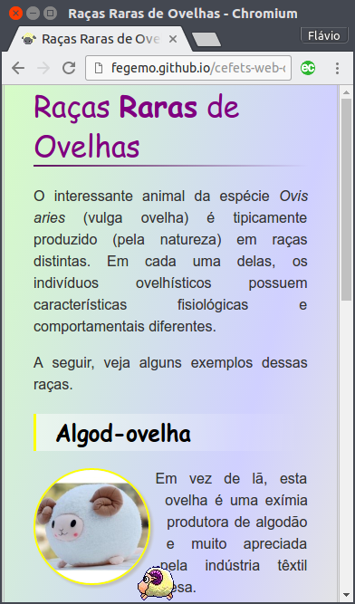
</iframe>
:::

- Uma página web é formada por **arquivos**:
  - **01** arquivo no formato HTML (*e.g.*, `racas-raras.html`)
  - Arquivos CSS (*e.g.*, `estilo.css`)
  - Arquivos JavaScript (*e.g.*, `ovelhita.js`)
  - Imagens (`.png`, `.jpg`, `.gif`)
  - Vídeos etc.

*[HTML]: Hypertext Markup Language*
*[CSS]: Cascading Stylesheets*

---
<!-- {"layout": "3-column-element-with-titles-expansible","preventSelection": "code"} -->
##  <!-- {.emoji} --> `racas-raras.`**`html`**

```html
<!DOCTYPE html>
<html>
  <head>
    <meta charset="utf-8">
    <meta name="viewport" content="width=device-width">
    <title>Raças Raras de Ovelhas</title>
    <link rel="stylesheet" href="estilos.css">
    <link rel="shortcut icon" href="favicon.ico" type="image/x-icon" />
  </head>
  <body>
    <h1>Raças <strong>Raras</strong> de Ovelhas</h1>
    <p>O interessante animal da espécie <em>Ovis aries</em> (vulga ovelha) é
      tipicamente produzido (pela natureza) em raças distintas. Em cada uma
      delas, os indivíduos ovelhísticos possuem características fisiológicas e
      comportamentais diferentes.</p>
    <p>A seguir, veja alguns exemplos dessas raças.</p>
    <h2>Algod-ovelha</h2>
    
    <p>Em vez de lã, esta ovelha é uma exímia produtora de algodão e
      muito apreciada pela indústria têxtil chinesa.</p>
    <p>Pessoas pagam milhões para poder criar destas em suas casas.</p>
    <h2>Pirá-tovelha</h2>
    
    <p>Ovelha marinha-saqueadora frequentemente vista nas ilhas caribenhas
      (seu habitat) navegando embarcações de madeira.</p>
    <p>Ao avistar uma destas, gire o leme completamente a estibordo, ice as
      velas e fuja para terra firme.</p>
    <h2>Ovelhopixel</h2>
    
    <p>Uma ovelha digital formada por um conjunto de quadradinhos coloridos.</p>
    <p>Ela precisa se recarregar de tempos em tempos.</p>
    <h2>Outras</h2>
    <ul>
      <li>Robôvelha</li>
      <li>Ninjo-velha</li>
      <li>Legovelha</li>
    </ul>
    <figure id="ovelha" class="sprite">
      
    </figure>
    <script src="shake.js" charset="utf-8"></script>
    <script src="ovelhinha.js" charset="utf-8"></script>
  </body>
</html>
```

##  <!-- {.emoji} --> `estilos.`**`css`**

```css
body {
  margin: 0 auto;
  max-width: 600px;
  border-left: 3px double silver;
  border-right: 3px double silver;
}

h1 {
  margin-top: 0;
  font-family: "Comic Sans", cursive;
  font-weight: normal;
  color: purple;
}

h2 {
  clear: both;
  color: black;
  font-family: "Comic Sans", cursive;
  background-image: linear-gradient(to right, yellow 1%, rgba(255,255,255,.5) 1%, transparent);
  padding: 0.15em 0.15em 0.15em 1em;
}

.circular {
  border-radius: 50%;
  shape-outside: circle(50%);
}

.foto-ovelha {
  display: inline-block;
  width: 125px;
  border: 2px solid yellow;
  box-shadow: 3px 3px 3px silver;
}

p {
  text-align: justify;
  line-height: 1.5em;
}

ul {
  list-style-image: url(ovelhinha.gif);
}

.sprite {
  width: 40px;
  height: 40px;
  overflow: hidden;
  position: fixed;
  bottom: 0;
  right: 0;
  margin: 0;
  cursor: move;
}

.sprite.invertido {
  transform: rotateY(.5turn);
}

.sprite > img {
  position: absolute;
  top: calc(-1*40px);
  left: calc(-3*40px);
}

.sprite.parado > img {
  top: calc(-1*40px);
  left: calc(-3*40px);
  animation: parado 1.5s steps(1) 1;
}

@keyframes parado {
  100% { left: calc(-3*40px); }
}
```

##  <!-- {.emoji} --> `ovelhita.`**`js`**

```js
const ANIMACOES = ['parado', 'andando', 'correndo', 'rolando', 'virando',
  'adormecendo', 'dormindo', 'despencando', 'despencado', 'pendurada'];

const ESTADOS = {
  reflexiva: { loop: 'parado', proximo: ['dormindo', 'andando', 'reflexiva'] },
  dormindo: { loop: 'dormindo', pre: 'adormecendo', pos: { anim: 'parado', duracao: 500 }, proximo: ['andando', 'reflexiva'] },
  andando: { loop: 'andando', proximo: ['andando', 'reflexiva', 'virando', 'correndo'] },
  correndo: { loop: 'correndo', proximo: ['andando', 'correndo'] },
  virando: { loop: 'virando', proximo: ['reflexiva', 'andando'] },
  rolando: { loop: 'rolando', proximo: ['reflexiva', 'dormindo'] },
  pendurada: { loop: 'pendurada', proximo: ['despencando'] },
  despencando: { loop: 'despencando', pos: { anim: 'despencado', duracao: 2000 }, proximo: ['reflexiva']}
};

const vibraTela = () => {
  // chama a vibração da bateria, se houver
  if ('vibrate' in navigator) {
    navigator.vibrate(1000);
  }

  // faz os elementos dentro do tela tremerem
  document.body.classList.add('vibrando');
  document.body.addEventListener('animationend', function(e) {
    e.target.removeEventListener(e.type, arguments.callee);
    document.body.classList.remove('vibrando');
  });
};

let ovelha = {
  el: document.querySelector('#ovelha'),

  // estado inicial
  estado: ESTADOS.reflexiva,
  tempoNoEstado: 0,
  estadosAnteriores: [],
  orientacao: 1,

  // define qual animação será tocada
  defineAnimacao: function(nomeAnimacao) {
    ANIMACOES.forEach((anim) => this.el.classList.remove(anim));
    this.el.classList.add(nomeAnimacao);
  },

  // define se a ovelha está olhando para esquerda ou direita
  defineOrientacao: function(novaOrientacao) {
    if (novaOrientacao <= 0) {
      this.el.classList.add('invertido');
    } else {
      this.el.classList.remove('invertido');
    }
    this.orientacao = novaOrientacao;
  },

  largura: 40,
  altura: 40,
  // coordenadas definem a posição do centro da ovelha
  x: 20,
  y: 20,
  // sistema de coordenadas começa na direita e embaixo
  definePosicao: function(x, y) {
    this.x = x;
    this.el.style.right = `${x - this.largura/2}px`;
    if (!!y) {
      this.y = y
      this.el.style.bottom = `${y - this.altura/2}px`;
    }
  },

  // invocada quando quisermos trocar o estado
  mudaEstado: function(novoEstado) {    
    switch (novoEstado) {
      case ESTADOS.despencando:
        this.velocidadeY = 0;
        break;
    }

    this.estadosAnteriores.unshift(this.estado);
    while (this.estadosAnteriores.length > 3) {
      this.estadosAnteriores.pop();
    }
    this.estado = novoEstado;
    this.tempoNoEstado = 0;
  },

  sorteiaProximoEstado: function() {
    return ESTADOS[this.estado.proximo[Math.floor(Math.random() * this.estado.proximo.length)]];
  },

  bateuNaTela: function() {
    return (this.x - this.largura/2 < 0 || this.x + this.largura/2 > window.innerWidth);
  },

  saiuDaTela: function() {
    return (this.x + this.largura/2 < 0 || this.x - this.largura/2 > window.innerWidth);
  },

  revolucionaNaTela: function() {
    let newX;
    if (this.x - this.largura/2 < 0) {
      newX = this.x + window.innerWidth + this.largura/2;
    } else if (this.x + this.largura/2 > window.innerWidth) {
      newX = -this.largura/2;
    }
    this.definePosicao(newX);    
  },

  passouDoChao: function() {
    return (this.y - this.altura/2 < 0);
  },

  tempoAntes: 0,
  atualiza: function(tempo) {
    let delta = tempo - this.tempoAntes;
    this.tempoNoEstado += delta;

    switch (this.estado) {
      case ESTADOS.reflexiva:
        if (this.tempoNoEstado > 1000) {
          this.mudaEstado(this.sorteiaProximoEstado());
        }
        break;

      case ESTADOS.dormindo:
        if (this.tempoNoEstado > 4000) {
          this.mudaEstado(this.sorteiaProximoEstado());
        }
        break;

      case ESTADOS.andando:
        this.definePosicao(this.x += this.orientacao * .025 * delta);
        if (this.tempoNoEstado > 3000) {
          this.mudaEstado(this.sorteiaProximoEstado());
        }
        if (this.saiuDaTela()) {
          this.revolucionaNaTela();
        }
        if (this.bateuNaTela() && this.estadosAnteriores.indexOf(ESTADOS.virando) === -1) {
          this.mudaEstado(ESTADOS.virando);
        }
        break;

      case ESTADOS.correndo:
        this.definePosicao(this.x += this.orientacao * .085 * delta);
        if (this.tempoNoEstado > 2500) {
          this.mudaEstado(this.sorteiaProximoEstado());
        }
        if (this.saiuDaTela()) {
          // dá a volta na tela
          this.revolucionaNaTela();
        }
        break;

      case ESTADOS.virando:
        // 500ms é o mesmo tempo definido na animação em CSS
        if (this.tempoNoEstado > 500) {
          this.defineOrientacao(this.orientacao * -1);
          this.mudaEstado(this.sorteiaProximoEstado());
        }
        break;

      case ESTADOS.rolando:
        // rola até bater na tela
        this.definePosicao(this.x += this.orientacao * .085 * delta);
        if (this.bateuNaTela()) {
          this.mudaEstado(this.sorteiaProximoEstado());
        }
        break;

      case ESTADOS.despencando:
        // vai caindo até atingir o chão
        this.definePosicao(this.x, this.y += this.velocidadeY * .085 * delta);
        this.velocidadeY -= 0.025;
        if (this.passouDoChao()) {
          this.definePosicao(this.x, this.altura/2);
          vibraTela();
          this.mudaEstado(this.sorteiaProximoEstado());
        }
        break;        
    }

    if (!this.deveParar) {
      requestAnimationFrame(this.atualiza.bind(this));
    }
    this.deveParar = false;
    this.tempoAntes = tempo;
  },

  para: function() {
    this.deveParar = true;
  }
};


ovelha.inicializa();
```

---
<!-- { "layout": "circling-balloons" } -->
## As três linguagens

- 

  Linguagem:
    ~ HTML: Hypertext Markup Language

  O que faz:
    ~ Conteúdo e estrutura da página (*e.g.*, o texto, imagens)

- 

  Linguagem:
    ~ CSS: Cascading Stylesheets

  O que faz:
    ~ Apresentação (estilos) da página (*e.g.*, core, tamanhos, detalhes)

- 

  Linguagem:
    ~ JavaScript

  O que faz:
    ~ Comportamento dinâmico na página (*e.g.*, a ovelhita)

---
<!-- {
  "layout": "2-column-highlight-and-content",
  "embeddedStyles": ".titulo-raras-ovelhas { color: purple; font-family: 'Comic Sans', cursive; font-weight: normal; border-bottom: 2px solid currentColor; }"
} -->
## A página das **Raras Ovelhas** <!-- {.titulo-raras-ovelhas} -->

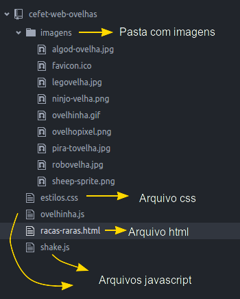

- O arquivo HTML referencia (usa, inclui) os arquivos de imagem, os arquivos
  de estilo e os de script. Por exemplo:
  - Incluindo imagem:
    ```html
    
    ```
  - Referenciando um arquivo CSS:
    ```html
    <link href="estilos.css" rel="stylesheet">
    ```


---
<!-- {"layout": "section-header", "hash": "minha-primeira-pagina-web"} -->
# Minha Primeira Página Web
## Como cria-las, o que elas comem, seu habitat etc.

- Ferramentas necessárias
- Um arquivo HTML
<!-- {ul:.content} -->

---
<!-- {"layout": "tall-figure-right"} -->
## Ferramentas Necessárias

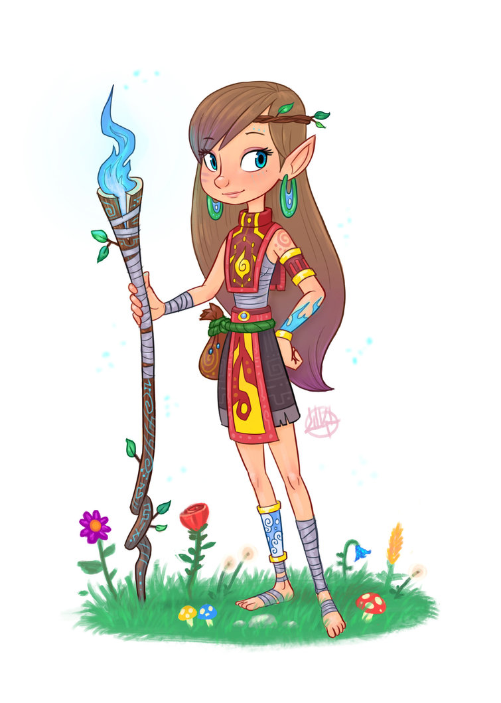
- O **KIT AVENTUREIRO** deve conter:

  01 editor de texto <!-- {dl:.width-50.bulleted-dt} -->
    ~ Pode ser o **bloco de notas** mesmo ;)
    ~ Mas existem outras ferramentas

  01 navegador web
    ~ **Chrome**, Firefox, Edge, Safari, Opera
    ~ Mas existem outras ferramentas

  ~~salgadinhos~~
    ~ fim!

---
# Atividade Prática <small>(1/4)</small>

**Enunciado**
  ~ Você vai recriar a página das raças raras de ovelhas.
  ~ Para isso, você deve baixar [este arquivo compactado][codigo-seminal-ovelhas]
    que contém as imagens, um arquivo CSS e dois arquivos JavaScript.
  ~ Leia os 4 slides da atividade <u>antes de começar</u>!

**Pré-Atividade**
  ~ 1. **Baixe** e **descompacte** os arquivos em uma pasta (e.g.,
       "Documentos/Ovelhas")
    1. Abra o bloco de notas e, com ele vazio,
       salve um novo arquivo, nessa pasta, com o nome `racas-raras.html`

[codigo-seminal-ovelhas]: https://github.com/fegemo/cefet-web-ovelhas/archive/exercicio.zip

---
<!-- {"preventSelection": "pre > code", "elementStyles": {"pre": "height: 160px"} } -->
# Atividade Prática <small>(2/4)</small>

- **Atividade 1**
  - Digite o conteúdo do arquivo `racas-raras.html` no editor de texto: <!-- {.compact-code} -->
    ```html
    <!DOCTYPE html>
    <html>
      <head>
        <meta charset="utf-8">
        <meta name="viewport" content="width=device-width">
        <title>Raças Raras de Ovelhas</title>
        <link rel="stylesheet" href="estilos.css">
        <link rel="icon" href="imagens/ovelhinha.png" type="image/png">
      </head>
      <body>
        <h1>Raças <strong>Raras</strong> de Ovelhas</h1>
        <p>O interessante animal da espécie <em>Ovis aries</em>
          (vulga ovelha) é tipicamente produzido (pela natureza)
          em raças distintas. Em cada uma delas, os indivíduos
          ovelhísticos possuem características fisiológicas e
          comportamentais diferentes.</p>
        <p>A seguir, veja alguns exemplos dessas raças.</p>
        <h2>Algod-ovelha</h2>
        
        <p>Em vez de lã, esta ovelha é uma exímia produtora de
          algodão e muito apreciada pela indústria têxtil
          chinesa.</p>
        <p>Pessoas pagam milhões para poder criar destas em
          suas casas.</p>
        <h2>Pirá-tovelha</h2>
        
        <p>Ovelha marinha-saqueadora frequentemente vista nas
          ilhas caribenhas (seu habitat) navegando embarcações
          de madeira.</p>
        <p>Ao avistar uma destas, gire o leme completamente a
          estibordo, ice as velas e fuja para terra firme.</p>
        <h2>Ovelhopixel</h2>
        
        <p>Uma ovelha digital formada por um conjunto
           de quadradinhos coloridos.</p>
        <p>Ela precisa se recarregar de tempos em tempos.</p>
        <h2>Outras</h2>
        <ul>
          <li>Robôvelha</li>
          <li>Ninjo-velha</li>
          <li>Legovelha</li>
        </ul>
        <script src="shake.js"></script>
        <script src="ovelhita.js"></script>
      </body>
    </html>
    ```
    - Repare que não é possível copiar/colar
- **Testando**
  - De tempos em tempos, **<u>abra o arquivo</u> no navegador** (_e.g._,
    dando dois cliques nele) para ver como está ficando

---
# Atividade Prática <small>(3/4)</small>

**Atividade 2**
  ~ Depois de copiado o código, você deve testar algumas _tags_, como:
    - `O <del>interessante</del> surpreendente animal`
  ~ Altere o conteúdo dentro do `<body>` usando as seguintes _tags_: `del`,
    `em`, `ins` e `mark`. Veja o que ocorre e entenda o funcionamento de
    cada uma _tag_ usada

---
# Atividade Prática <small>(4/4)</small>

**Pesquisando**
  ~ Pesquise na Web (_e.g._, [Google][google], [Bing][bing]) sobre essas _tags_,
    tipo assim: "html tag del" (sem as áspas)
    - 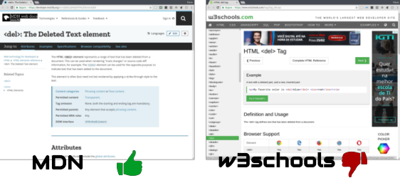 <!-- {.push-right style="height: 125px"} -->
      Prefira sempre a página MDN (informação confiável, completa e sem propagandas)


*[MDN]: Mozilla Developer Network*
[google]: http://google.com
[bing]: http://bing.com
[moodle]: http://ava.cefetmg.br
