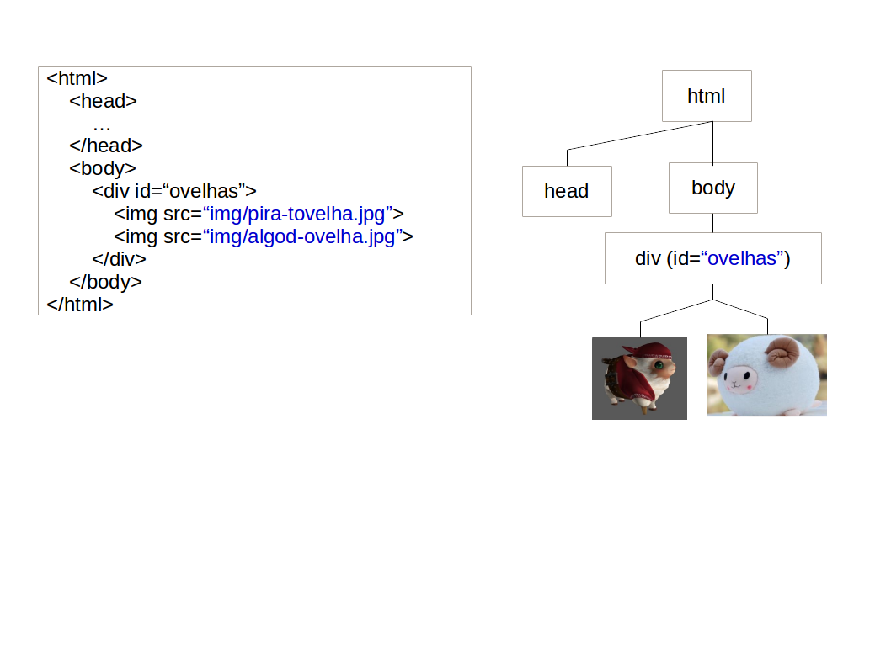
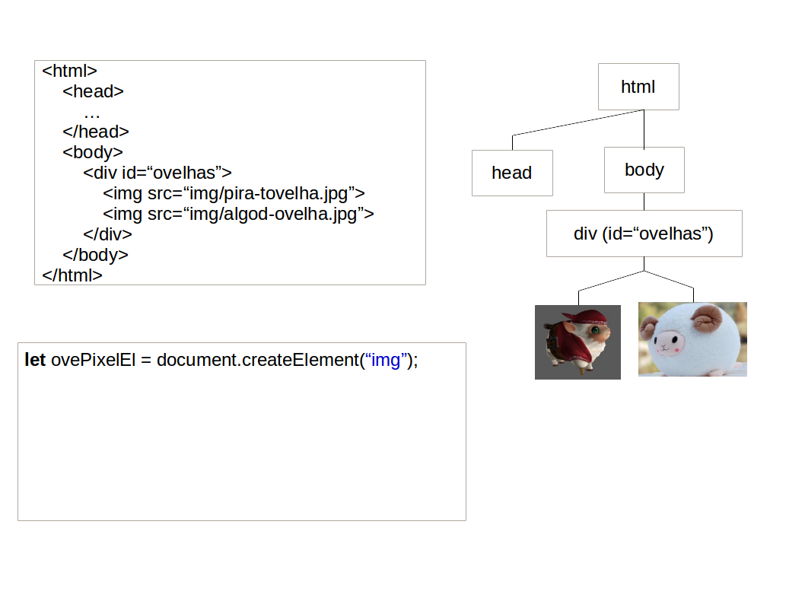
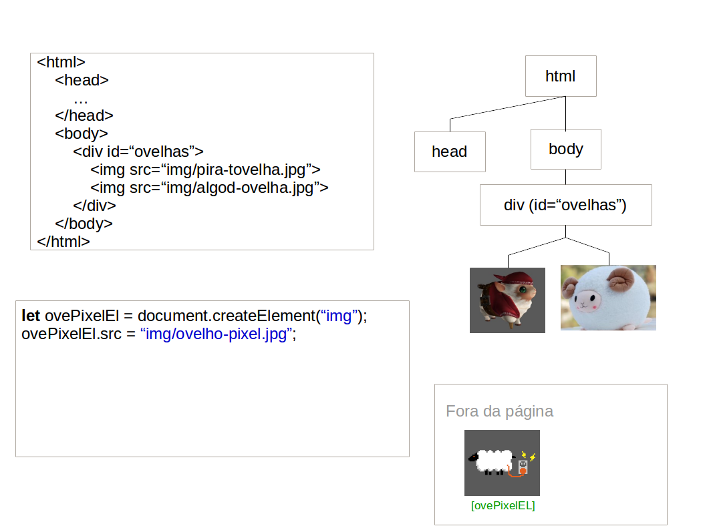
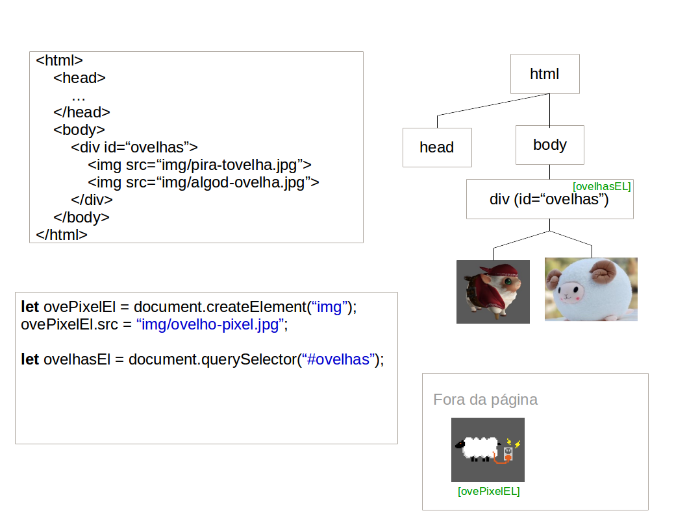
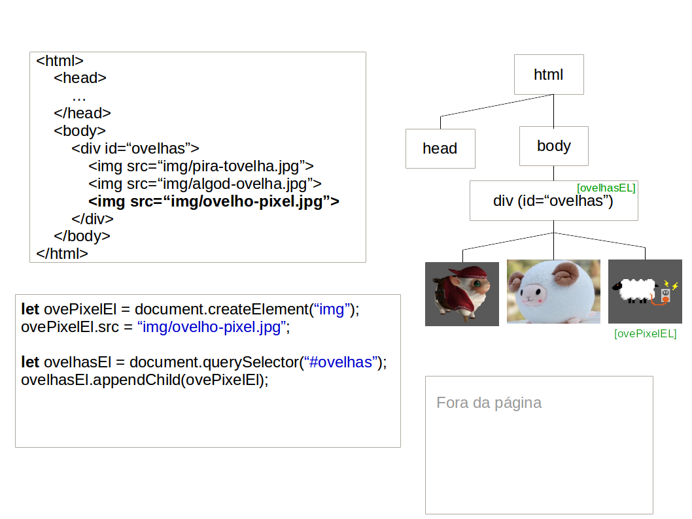
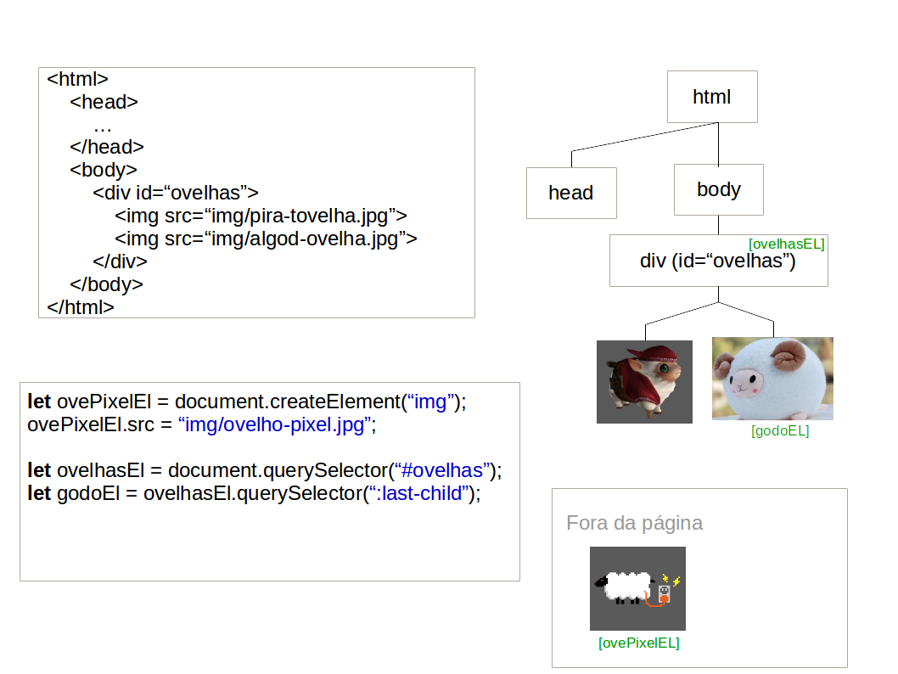
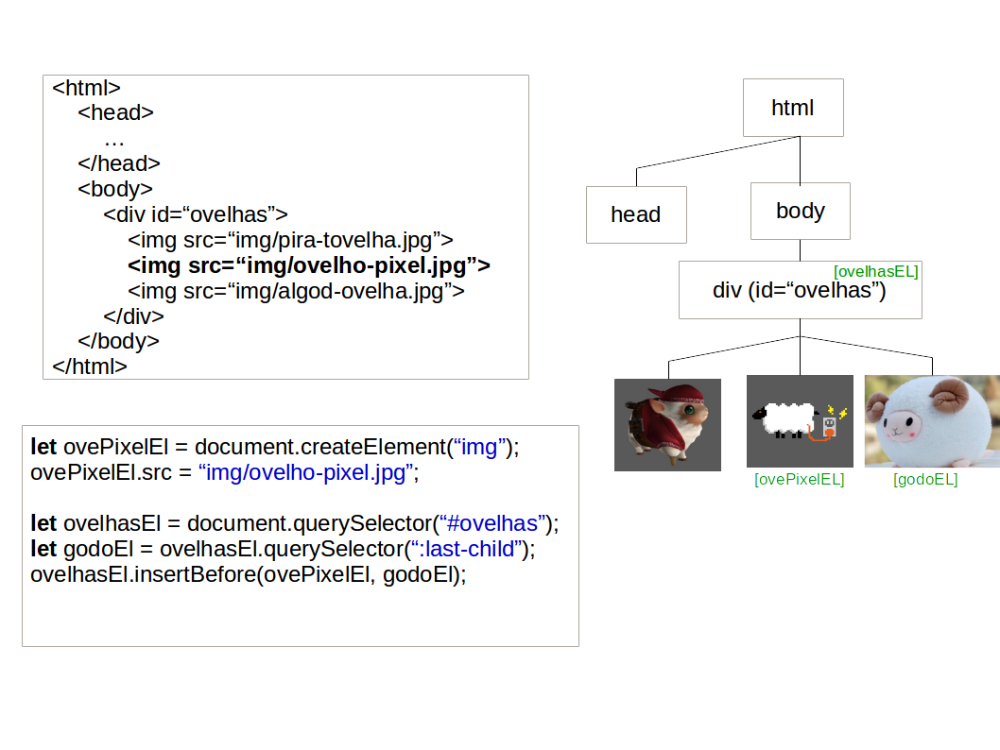
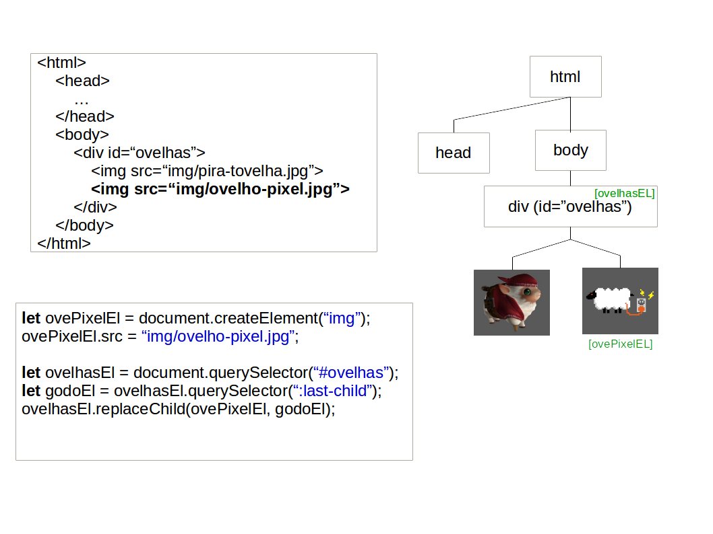
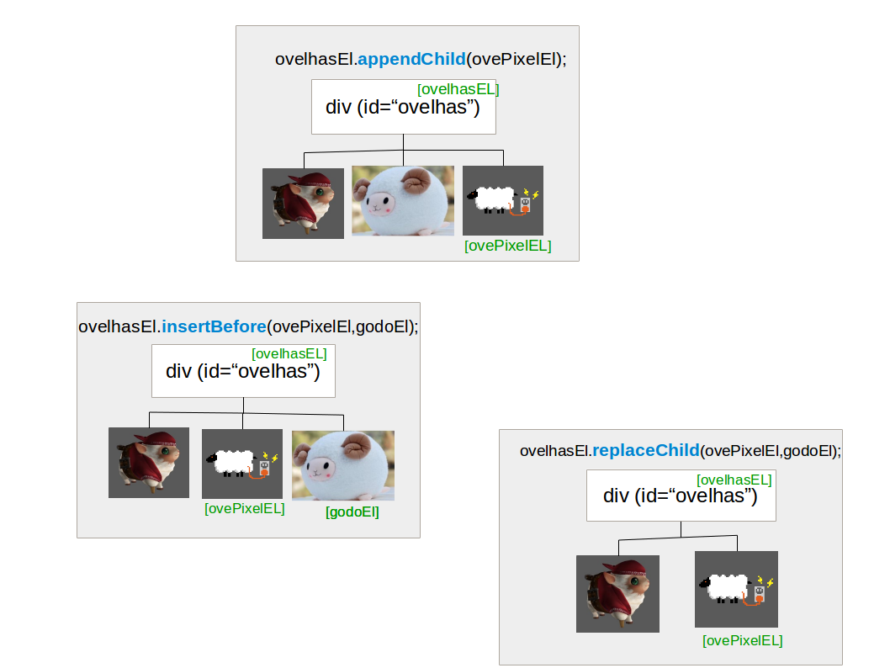
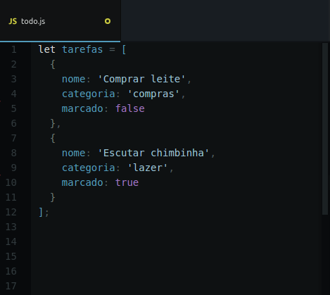

<!-- {"layout": "title"} -->
# **JavaScript** parte 5
## Criando elementos HTML<br>e a Lista de Tarefas :notebook:


---
<!-- {"layout": "centered"} -->
# Roteiro

1. [Criando elementos HTML dinamicamente](#criando-elementos-html-dinamicamente)
1. [Lista de Tarefas](#lista-de-tarefas) :notebook:
   - Exemplo 1: [Albums de música](#albums-de-musica)
   - Exemplo 2: [Agenda telefônica](#agenda-telefonica)


---
## Criando elementos dinamicamente

- É possível criar elementos dinamicamente, de duas formas:
  1. Definindo a propriedade de **`innerHTML` de um elemento** da árvore
     para **uma string descrevendo uma estrutura HTML** (já vimos):
     ```js
     let listaEl = document.querySelector('#lista-de-dados');
     listaEl.innerHTML = '<li></li>';
     ```
  1. Instanciando elementos e os adicionando ao DOM, que é feito em
     3 passos (detalhados a seguir):
     ```js
     // 1. Solicitamos ao document a criação de um elemento
     // 2. Configuramo-lo (atributos, id, classes etc.)
     // 3. Inserimo-lo na árvore
     ```

---
<!-- {"classes": "compact-code-more"} -->
# Instanciação de elementos HTML

- A função **document.createElement** cria um elemento HTML <!-- {ul:.compact-code.bulleted-0} -->
  - Devemos especificar a _tag_ do elemento que iremos criar
- Exemplo - criação de uma imagem:
  ```js
  // 1. Solicitamos ao document a criação de um elemento
  let ovelhaEl = document.createElement('img');       // cria uma 
  // 2. Configuramo-lo (atributos, id, classes etc.)
  ovelhaEl.src = 'images/ovelho-pixel.png';           // 
  ovelhaEl.classList.add('raca');                     // 
  ```
  - Resultado:
    ```HTML
    
    ```
- **Atenção**: você **criou** o elemento, mas <u>**ainda não
  o adicionou**</u> na árvore

---
## Inserção do elemento na árvore DOM

- Para vincularmos um elemento criado, precisamos conhecer quem será seu
  **pai**
- Logo após, podemos adicionar o elemento usando um dos seguintes comandos:
  1. `appendChild`: será o filho mais à direita
  1. `insertBefore`: será o filho que vem logo antes de outro
  1. `replaceChild`: substituirá um filho existente

```js
let containerEl = document.querySelector('#ovelhas');
let novaOvelhaEl = document.createElement('img');
novaOvelhaEl.src = 'img/ovelho-pixel.png';
containerEl.appendChild(novaOvelhaEl);
```

---
## Vinculação na árvore DOM com **(1) `appendChild`**

::: figure .figure-slides.clean.flex-align-center.medium-width.invert-colors-dark-mode
<!-- {.full-width.bullet.figure-step.bullet-no-anim} -->
<!-- {.full-width.bullet.figure-step.bullet-no-anim} -->
<!-- {.full-width.bullet.figure-step.bullet-no-anim} -->
<!-- {.full-width.bullet.figure-step.bullet-no-anim} -->
<!-- {.full-width.bullet.figure-step.bullet-no-anim} -->
:::

---
## Vinculação na árvore DOM com **(2) `insertBefore`**

::: figure .figure-slides.clean.flex-align-center.medium-width.invert-colors-dark-mode
<!-- {.full-width.bullet.figure-step.bullet-no-anim} -->
<!-- {.full-width.bullet.figure-step.bullet-no-anim} -->
<!-- {.full-width.bullet.figure-step.bullet-no-anim} -->
:::

---
## Vinculação na árvore DOM com **(3) `replaceChild`**

::: figure .figure-slides.clean.flex-align-center.medium-width.invert-colors-dark-mode
<!-- {.full-width.bullet.figure-step.bullet-no-anim} -->
<!-- {.full-width.bullet.figure-step.bullet-no-anim} -->
<!-- {.full-width.bullet.figure-step.bullet-no-anim} -->
:::

---
## Resumindo: `appendChild`, `insertBefore` e `replaceChild`


<!-- {p:.medium-width.centered} -->
<!-- {.full-width} -->

---
## **Inserindo texto** nos elementos

- Podemos colocar texto nos elementos de 2 formas: <!-- {ul:.compact-code} -->
  1. Usando `document.createTextNode('texto aqui')`:
     ```js
     let bodyEl = document.querySelector('body');
     let pEl = document.createElement('p');
     let txtEl = document.createTextNode('Olá parágrafo!'); // <--
     bodyEl.appendChild(pEl);                   // põe o parágrafo em <body>
     pEl.appendChild(txtEl);                    // põe o texto no <p>
     ```
  1. Usando `elemento.innerHTML` (👍 mais _easy_):
     ```js
     let bodyEl = document.querySelector('body');
     let pEl = document.createElement('p');
     bodyEl.appendChild(pEl);                   // põe o parágrafo em <body>
     pEl.innerHTML = 'Olá parágrafo!';          // define o innerHTML do <p>
     ```

---
<!-- { "hash": "remocao-de-elementos"} -->
# Remoção de Elementos

- Usamos `containerEl.removeChild(el)` ou, para remover todos, `innerHTML`:  <!-- {ul:.compact-code} -->
  ```html
  <main>
    
  </main>
  ```
  ```js
  let mainEl = document.querySelector('main');
  let imgEl = document.querySelector('#urso');

  mainEl.removeChild(imgEl);      // remove a 
  // ou...
  mainEl.innerHTML = '';          // remove tudo o que estiver em <main></main>
  ```

---
<!-- {"layout": "section-header", "hash": "lista-de-tarefas"} -->
# Lista de Tarefas :notebook:
## Saiba o que procrastinar a seguir

- Atividade de hoje
  - Exercício 1
  - Exemplo: albums de música
  - Exercício 2
  - Exemplo: lista telefônica
<!-- {ul:.content} -->

---
<!-- {"backdrop": "lista-de-tarefas"} -->

---
# Lista de Tarefas :notebook:

- Crie um sisteminha de gerenciamento de tarefas :notebook:
- Há 3 atividades:
  1. Inserir elementos HTML para as tarefas pré-existentes no vetor `itensTodo`
  1. Permitir o usuário inserir novas tarefas
  1. Adicionar elementos da API do HTML5 na prática


---
## Exercício 1

-  <!-- {.push-right} -->
  Já existem 2 tarefas no arquivo JavaScript `tarefas.js`
  - Mas a página não está mostrando elas na lista de tarefas
- Neste exercício, você deve criar uma função `insereTarefaNaPagina` que
  recebe **01 objeto representando 01 tarefa** (repare o singular) como
  parâmetro e cria os respectivos elementos HTML para mostrar essa
  tarefa na página

---
<!-- { "hash": "albums-de-musica"} -->
## Exemplo: Albums de música

<iframe width="100%" height="550" src="//jsfiddle.net/fegemo/s1p824jd/embedded/result,html,js/" allowfullscreen="allowfullscreen" frameborder="0" class="bordered rounded"></iframe>

---
## Exercício 2

- Agora você deve permitir que o usuário insira uma nova tarefa
  1. No clique do botão:
     1. Crie um objeto que representa a nova tarefa
     1. Coloque esse objeto no vetor `tarefas`
     1. Chame a função `insereTarefaNaPagina`, passando o objeto
        da nova tarefa como argumento
     1. Opcionais:
        1. Limpe o `value` do campo de texto para que o usuário possa
           inserir a próxima tarefa
        1. Mova o foco da aplicação de volta para o campo de texto
           chamando `campoDeTextoEl.focus()`

---
<!-- { "hash": "agenda-telefonica"} -->
## Exemplo: Agenda telefônica

<iframe width="100%" height="550" src="//jsfiddle.net/fegemo/zrmpjaLg/embedded/result,html,js/" allowfullscreen="allowfullscreen" frameborder="0" class="bordered rounded"></iframe>
